# DenialGuard AI — Unified Technical Architecture & Platform Documentation

> **DenialGuard AI** is a production-grade Healthcare Revenue Cycle Management (RCM) AI platform that prevents medical claim denials before submission, isolates denial drivers using exact Shapley explainability, accelerates clinical appeals, and provides end-to-end audit tracking backed by Supabase PostgreSQL and FastAPI.

---

## 1. Executive Summary & Problem Space

### 1.1 The Healthcare Revenue Cycle Challenge
In the United States healthcare billing ecosystem, **15% to 20% of submitted medical claims** are denied upon initial adjudication by commercial insurance carriers and government payers (Medicare, Medicaid).
- **$260+ Billion Annual Impact:** Billions in provider revenue are delayed or lost annually to claim rejections.
- **Administrative Rework Costs:** Reworking a single denied claim costs healthcare systems an average of **$118** and adds **30 to 90 days** in aging accounts receivable (A/R).
- **Primary Denial Drivers:** Missing prior authorizations, unattached clinical operative notes, inactive patient coverage on Date of Service, timely filing deadline expirations, fee schedule variances, and coding/modifier mismatches.

### 1.2 The DenialGuard Solution
DenialGuard AI halts claim denials before claims leave the hospital electronic health record (EHR) or billing office:
1. **Pre-Submission Risk Scoring:** Ingests standard CMS-1500 / UB-04 claim parameters and calculates a calibrated denial probability (`0%–100%`) in `< 110ms`.
2. **Exact Root Cause Attribution (SHAP TreeExplainer):** Explains precisely which specific clinical and billing attributes elevated or lowered risk.
3. **SHAP-Driven CARC Code Forecasting:** Predicts the exact Claim Adjustment Reason Code (e.g., `CO-197`, `CO-16`, `CO-27`, `CO-29`, `CO-50`, `CO-97`, `CO-4`, `CO-45`) tied directly to the top-weighted risk-increasing SHAP driver.
4. **Actionable Remediation Engine:** Offers targeted, prescriptive fixes (e.g., attaching required clinical chart notes, acquiring prior authorization reference numbers, adjusting NCCI modifiers).
5. **Strict Schema & Vocabulary Normalization:** Canonicalized vocabularies enforced by Pydantic `Literal[...]` types across frontend and backend for all categorical attributes (`pa_status`, `referral_status`, `network_status`, `eligibility_status`, `payer`, `provider_specialty`, `plan_type`).
6. **CPT+Payer Normalized Deviation:** `claim_amount_deviation` engineered feature keyed by `CPT + Payer` and normalized as a percentage deviation from historical benchmark means.
7. **Native Document Ingestion & Re-Prediction:** Allows billers to upload real PDF/TIFF clinical chart notes via native file pickers, automatically re-running the ML model and updating the claim state in real time.
8. **Clinical Appeals Pipeline & Direct Claim Linking:** Full multi-stage appeal tracking (`Drafting`, `Submitted`, `Payer Review`, `Resolved`) with database persistence when initiating appeals directly from the claims log or claim detail view.
9. **Real-Time Notification System:** Live unread notification bell panel tracking high-risk predictions (`≥ 60%`), document uploads, appeal status changes, and team onboarding.
10. **Reconciled 3-Tier Risk Thresholds:** Unified threshold architecture (`< 35%` Clean/Low Risk, `35%–59.9%` Review Recommended, `≥ 60%` High Risk Alert).
11. **Closed-Loop Audit & Feedback:** Securely records predictions, file attachments, and actual adjudication outcomes in Supabase PostgreSQL for continuous model retraining.

---

## 2. End-to-End System Architecture

```mermaid
graph TD
    subgraph FrontendTier ["Frontend Tier (React 19 + TypeScript + Vite + Wouter)"]
        UI["DenialGuard Web App (:3000)"]
        AuthUI["Auth & Onboarding (/sign-in, /create-account)"]
        WorklistUI["Prioritized Worklist & Triage (/worklist)"]
        PredictUI["Pre-Submission Claim Scoring (/predict)"]
        DetailUI["Claim Lifecycle & Native Upload (/claims/:id)"]
        AppealsUI["Appeals Pipeline Kanban (/appeals)"]
        NotifUI["Notification Flyout & Unread Badge"]
        PayersUI["Payer Rules Library (/payers)"]
        AnalyticsUI["Denial Analytics & Reports (/analytics)"]
        SettingsUI["Dynamic Team & Security Settings (/settings)"]
    end

    subgraph GatewayTier ["API Gateway & Security Layer (FastAPI :8000)"]
        API["FastAPI Application (app/main.py)"]
        AuthMiddleware["JWT Bearer Authentication (app/core/deps.py)"]
        Security["BCrypt Hashing & PyJWT HS256 (app/core/security.py)"]
        SchemaValidation["Strict Pydantic Literal Validation (app/schemas.py)"]
    end

    subgraph MLTier ["Machine Learning & Explainability Engine"]
        FeatureEng["Feature Engineering & Lookups (app/model/predict.py)"]
        XGBoost["Production XGBoost Classifier (model.pkl)"]
        SHAP["SHAP TreeExplainer"]
        RuleEngine["SHAP-Driven CARC & Remediation Engine"]
    end

    subgraph PersistenceTier ["Persistence & Storage Layer"]
        DBRouter["Dual-Mode Storage Adapter (app/db.py)"]
        SupabaseDB[("Supabase PostgreSQL")]
        WorkspacesTable["workspaces Table"]
        UsersTable["users Table"]
        InvitesTable["workspace_invites Table"]
        ClaimsTable["claims_log Table (NUMERIC(10,2) Precision)"]
        DocsTable["claim_documents Table"]
        AppealsTable["appeals Table"]
        NotifsTable["notifications Table"]
        SettingsTable["workspace_settings Table"]
        InMemoryStore[("Clean In-Memory Store (Zero-Crash Fallback)")]
    end

    UI -->|HTTP / REST + Bearer JWT| API
    AuthUI -->|POST /auth/login, POST /auth/register| API
    PredictUI -->|POST /predict| API
    DetailUI -->|POST /claims/:id/documents, GET /claims/:id/documents| API
    DetailUI -->|POST /appeals, POST /submit-outcome| API
    WorklistUI -->|GET /claims-log| API
    AppealsUI -->|GET /appeals, POST /appeals, PATCH /appeals/:id/status| API
    NotifUI -->|GET /notifications, POST /notifications/:id/read| API
    SettingsUI -->|GET /workspace/members, POST /workspace/invite, GET/POST /workspace/settings| API

    API --> AuthMiddleware --> Security
    API --> SchemaValidation
    API --> FeatureEng
    FeatureEng --> XGBoost
    FeatureEng --> SHAP
    XGBoost --> RuleEngine
    SHAP --> RuleEngine
    RuleEngine --> API

    API --> DBRouter
    DBRouter -->|Cloud Mode| SupabaseDB
    SupabaseDB --> WorkspacesTable
    SupabaseDB --> UsersTable
    SupabaseDB --> InvitesTable
    SupabaseDB --> ClaimsTable
    SupabaseDB --> DocsTable
    SupabaseDB --> AppealsTable
    SupabaseDB --> NotifsTable
    SupabaseDB --> SettingsTable
    DBRouter -->|Fallback Mode| InMemoryStore
```



---

## 3. Technology Stack Matrix

| Layer | Framework / Library | Version / Spec | Purpose & Implementation |
| :--- | :--- | :--- | :--- |
| **Frontend Framework** | React + TypeScript | `19.0.0` | Declarative, component-driven UI with strict TypeScript type safety |
| **Build & Tooling** | Vite | `7.3.0+` | Lightning-fast HMR and production bundle compilation |
| **Routing** | Wouter | `3.3.0+` | Lightweight, hook-based declarative client-side routing |
| **UI Aesthetics & Icons** | Vanilla CSS + Lucide Icons | Latest | Custom glassmorphic CSS design system, micro-animations, Lucide React icons |
| **Data Visualizations** | Recharts | `2.15.0+` | Responsive SVG charts for denial trends, risk distributions, and payer metrics |
| **Toast Notifications** | Sonner | Latest | Real-time feedback for predictions, uploads, invites, appeals, and status updates |
| **Backend Framework** | FastAPI | `>=0.110.0` | High-performance async REST API framework with OpenAPI / Swagger docs |
| **ASGI Web Server** | Uvicorn | `>=0.28.0` | Production ASGI web server running on port 8000 with `--reload` support |
| **Machine Learning** | XGBoost + Scikit-Learn | `>=2.0.0` | Gradient-boosted decision trees trained on 120,000 CMS claim records |
| **Explainability (XAI)**| SHAP | `>=0.45.0` | TreeExplainer providing per-claim Shapley attribution values |
| **Authentication & RBAC**| PyJWT + Passlib/BCrypt | `>=2.8.0` | Stateless JWT Bearer tokens with 24-hour expiration & strict bcrypt verification |
| **Data Validation** | Pydantic v2 | `>=2.6.0` | Strict type validation with `Literal[...]` categories & `decimal.Decimal` monetary precision |
| **Persistence** | Supabase (PostgreSQL) | `>=2.3.0` | Cloud PostgreSQL with Row Level Security and clean dual-mode in-memory fallback |

---

## 4. Canonical Vocabularies & Schema Constraints

To prevent vocabulary divergence across layers, the platform strictly enforces canonical string vocabularies:

| Field | Canonical Values | Pydantic Type |
| :--- | :--- | :--- |
| `pa_status` | `"Approved"`, `"Denied"`, `"Missing"`, `"Pending"`, `"Not Required"` | `Literal[...]` |
| `referral_status` | `"Active"`, `"Missing"`, `"Not Required"`, `"Expired"` | `Literal[...]` |
| `network_status` | `"In-Network"`, `"Out-of-Network"` | `Literal[...]` |
| `eligibility_status` | `"Active"`, `"Inactive"`, `"Pending"`, `"Terminated"` | `Literal[...]` |
| `payer` | `"Medicare"`, `"Medicaid"`, `"UnitedHealthcare"`, `"BlueCross"`, `"Aetna"`, `"Cigna"`, `"Humana"` | `Literal[...]` |
| `plan_type` | `"HMO"`, `"PPO"`, `"EPO"`, `"POS"`, `"Medicare Advantage"`, `"Commercial"` | `Literal[...]` |
| `claim_type` | `"Professional"`, `"Institutional"`, `"Dental"`, `"Vision"` | `Literal[...]` |
| `provider_specialty` | `"Cardiology"`, `"Orthopedics"`, `"General Practice"`, `"Dermatology"`, `"Oncology"`, `"Radiology"`, `"Neurology"`, `"Internal Medicine"`, `"Emergency Medicine"` | `Literal[...]` |

---

## 5. Machine Learning & Explainable AI (XAI) Pipeline

### 5.1 Engineered Feature Definitions
1. **`hist_denial_rate_cpt_payer`:** Historical denial rate keyed by `CPT::Payer` lookup priors.
2. **`hist_denial_rate_provider_payer`:** Historical denial rate keyed by `Specialty::Payer` priors.
3. **`claim_amount_deviation`:** Percentage deviation of the billed charge relative to the mean benchmark charge for that specific procedure and payer:
   $$\text{claim\_amount\_deviation} = \left(\frac{\text{charge\_amount} - \overline{\text{charge}}_{\text{cpt, payer}}}{\overline{\text{charge}}_{\text{cpt, payer}}}\right) \times 100\%$$

### 5.2 SHAP-Driven CARC & Remediation Engine
When a claim score is evaluated, `determine_carc_and_action()` consults `top_factors` from SHAP TreeExplainer and selects the CARC code tied directly to the highest-weighted risk-increasing feature:

| Top Contributing SHAP Driver | CARC Code | Code Description | Actionable Pre-Submission Recommendation |
| :--- | :---: | :--- | :--- |
| `pa_status` | **`CO-197`** | Pre-certification / Prior Auth Absent | *"Pre-certification / Prior authorization absent, pending, or denied. Obtain prior authorization approval number from payer and append to Box 23/24."* |
| `documentation_flag` | **`CO-16`** | Missing Clinical Documentation | *"Claim lacks required clinical documentation. Attach medical records, operative notes, or lab reports supporting medical necessity."* |
| `eligibility_status` | **`CO-27`** | Expenses Incurred After Coverage Terminated | *"Expenses incurred after coverage terminated or patient eligibility inactive. Re-verify active subscriber policy with payer before submitting."* |
| `days_to_filing_deadline` | **`CO-29`** | Timely Filing Limit Exceeded | *"Submission is within X days of timely filing deadline. Expedite batch processing immediately to avoid time-limit denial."* |
| `network_status` / `referral_status` | **`CO-50`** | Out-of-Network / Missing PCP Referral | *"Out-of-network service or missing PCP referral. Obtain and document formal referral authorization prior to billing."* |
| `cpt_code` / `modifiers` | **`CO-4`** | Procedure Code / Modifier Inconsistency | *"Procedure code may require modifier for distinct procedural service. Review bundling edits and consider appending Modifier 25 or 59."* |
| `claim_amount_deviation` / `charge_amount` | **`CO-45`** | Charge Amount Fee Schedule Variance | *"Charge amount exceeds expected fee schedule variance. Verify billed units and contracted rate schedule."* |
| `hist_denial_rate_*` | **`CO-97`** | Historical Denial Pattern | *"Elevated historical denial pattern for this CPT/Payer combination. Conduct secondary audit on charge amounts and diagnostic coding alignment."* |
| Score `< 35.0%` | **`CLEAN`** | Clean Claim Pass | *"Claim validation passed with low denial risk. Ready for clean EDI submission."* |

---

## 6. API Endpoints & Data Contracts

All protected endpoints require `Authorization: Bearer <token>` in the HTTP request headers.

### 6.1 Authentication & Workspace Endpoints
- `POST /auth/login`: Authenticates credentials with bcrypt verification. Returns signed JWT.
- `POST /auth/register`: Creates organization or joins workspace via 16-character invite code (`NORTHSTAR-XXXXXXXX`).
- `POST /workspace/invite`: Generates single-use role-based workspace invite code (7-day expiry).
- `GET /workspace/members`: Retrieves real-time list of members within the active workspace.
- `GET/POST /workspace/settings`: Fetches and updates workspace triage rules (`auto_assign`, `default_appeal_deadline_days`, `high_risk_threshold`).
- `GET/POST /workspace/security`: Fetches and updates HIPAA security parameters (`session_timeout_minutes`, `audit_log_retention_days`).

### 6.2 ML Prediction & Document Ingestion
- `POST /predict`: Evaluates 20 raw inputs + 3 engineered features, computes SHAP values, determines CARC code, sanitizes Decimal types for Supabase Postgres storage, logs claim to audit trail (`persisted: boolean`), and fires high-risk alerts when risk $\ge 60\%$.
- `POST /claims/{claim_id}/documents`: Ingests multipart clinical files (`.pdf`, `.png`, `.jpg`), auto-repredicts risk with documentation attached, and updates claim record.
- `GET /claims/{claim_id}/documents`: Returns list of attached documents for a claim with workspace-wide visibility.

### 6.3 Appeals Pipeline, Real-Time Sync & Outcome Feedback
- `GET /appeals`: Returns all active appeals across 4 pipeline stages (`drafting`, `submitted`, `payer_review`, `resolved`).
- `POST /appeals`: Initiates a clinical appeal directly from claim records or Appeals Kanban, persisting record to DB and emitting workspace notification.
- `PATCH /appeals/{appeal_id}/status`: Advances appeal stage with audit timestamping.
- `POST /submit-outcome`: Records final clearinghouse adjudication outcome (`paid` vs `denied`).
- `GET /claims-log`: Retrieves paginated audit log of evaluated claims.
- **Live Multi-Session Synchronization:** `Home.tsx` synchronizes `appeals`, `denials`, and `notifications` across browser sessions via a 3-second background polling cycle, window focus/visibility triggers, and path-driven route re-evaluation.

---

## 7. Automated Test & Verification Suites

| Test Suite | Execution Command | Purpose & Coverage |
| :--- | :--- | :--- |
| **Comprehensive Fixes Verification** | `python test_fixes_verification.py` | Validates Priorities 1–7: SHAP-driven CARC selection, canonical vocabularies, schema literal rejection (`422`), percentage deviation, and real appeal creation in DB. |
| **Supabase Persistence & Error Handling** | `python test_supabase_persistence_fix.py` | Validates live Supabase PostgreSQL insertion, Decimal float sanitization, direct DB row verification, and graceful fallback handling (`persisted: false`). |
| **Backend Integration Suite** | `python test_backend.py` | Tests all FastAPI endpoints, JWT auth rejection, SHAP latency, outcome submission, and claim logs. |
| **Round 2 Specification Suite** | `python test_round2_spec.py` | Validates invite codes, document upload reprediction, notifications, and settings persistence. |
| **Frontend Production Build** | `npm run build` (in `denialguard-ai`) | Validates TypeScript typing and builds optimized production bundles. |

---

## 8. Quickstart & Execution Guide

### 8.1 Starting the Backend API
```powershell
cd backend
python -m pip install -r requirements.txt
python app/model/train.py  # Optional: retrain model & lookups
python -m uvicorn app.main:app --host 127.0.0.1 --port 8000 --reload
```
- Interactive Swagger API Documentation: `http://127.0.0.1:8000/docs`

### 8.2 Starting the Frontend Client
```powershell
cd denialguard-ai
pnpm install
pnpm dev
```
- Web Application: `http://127.0.0.1:3000`

---

## 9. Default Test Credentials

| Account Role | Email Address | Password | Workspace | Access Scope |
| :--- | :--- | :--- | :--- | :--- |
| **Admin** | `admin@denialguard.com` | `password123` | Northstar Health System | Full administration, invite generation & compliance logs |
| **Denial Analyst** | `malvarez@northstar.health` | `password123` | Northstar Health System | Risk analysis, clinical appeals & adjudication |
| **Biller** | `jlee@northstar.health` | `password123` | Northstar Health System | Pre-submission scoring, charge review & claim triage |
| **Biller** | `biller@denialguard.com` | `password123` | Northstar Health System | Pre-submission scoring & claim remediation |
