# DenialGuard AI — Unified Technical Architecture & Platform Documentation

> **DenialGuard AI** is a production-grade Healthcare Revenue Cycle Management (RCM) AI platform that prevents medical claim denials before submission, isolates denial drivers using exact Shapley explainability, accelerates clinical appeals, and provides end-to-end audit tracking backed by Supabase PostgreSQL and FastAPI.

---

## 1. Executive Summary & Problem Space

### 1.1 The Healthcare Revenue Cycle Challenge
In the United States healthcare billing ecosystem, **15% to 20% of submitted medical claims** are denied upon initial adjudication by commercial insurance carriers and government payers (Medicare, Medicaid).
- **$260+ Billion Annual Impact:** Billions in provider revenue are delayed or lost annually to claim rejections.
- **Administrative Rework Costs:** Reworking a single denied claim costs healthcare systems an average of **$118** and adds **30 to 90 days** in aging accounts receivable (A/R).
- **Primary Denial Drivers:** Missing prior authorizations, unattached clinical operative notes, inactive patient coverage on Date of Service, timely filing deadline expirations, and coding/modifier mismatches.

### 1.2 The DenialGuard Solution
DenialGuard AI halts claim denials before claims leave the hospital electronic health record (EHR) or billing office:
1. **Pre-Submission Risk Scoring:** Ingests standard CMS-1500 / UB-04 claim parameters and calculates a calibrated denial probability (`0%–100%`) in `< 110ms`.
2. **Exact Root Cause Attribution (SHAP TreeExplainer):** Explains precisely which specific clinical and billing attributes elevated or lowered risk.
3. **CARC Code Forecasting:** Predicts the exact Claim Adjustment Reason Code (e.g., `CO-197`, `CO-16`, `CO-27`, `CO-29`, `CO-50`, `CO-97`, `CO-4`).
4. **Actionable Remediation Engine:** Offers targeted, prescriptive fixes (e.g., attaching required clinical chart notes, acquiring prior authorization reference numbers, adjusting NCCI modifiers).
5. **Native Document Ingestion & Re-Prediction:** Allows billers to upload real PDF/TIFF clinical chart notes via native file pickers, automatically re-running the ML model and updating the claim state in real time.
6. **Multi-Tenant Workspace & Team Invite Flow:** Supports organization isolation with 16-character invite codes and role-based access control (RBAC).
7. **Closed-Loop Audit & Feedback:** Securely records predictions, file attachments, and actual adjudication outcomes in Supabase PostgreSQL for continuous model training.

---

## 2. End-to-End System Architecture

```mermaid
graph TD
    subgraph FrontendTier ["Frontend Tier (React 19 + TypeScript + Vite + Wouter)"]
        UI["DenialGuard Web App (:3000)"]
        AuthUI["Auth & Onboarding (/sign-in, /create-account)"]
        WorklistUI["Prioritized Worklist & Triage (/worklist)"]
        PredictUI["Pre-Submission Claim Scoring (/predict)"]
        DetailUI["Claim Lifecycle & Native Upload (/claims/:id)"]
        AppealsUI["Appeals Pipeline Kanban (/appeals)"]
        PayersUI["Payer Rules Library (/payers)"]
        AnalyticsUI["Denial Analytics & Reports (/analytics)"]
        SettingsUI["Team Invites & Security Toggles (/settings)"]
    end

    subgraph GatewayTier ["API Gateway & Security Layer (FastAPI :8000)"]
        API["FastAPI Application (app/main.py)"]
        AuthMiddleware["JWT Bearer Authentication (app/core/deps.py)"]
        Security["BCrypt Hashing & PyJWT HS256 (app/core/security.py)"]
    end

    subgraph MLTier ["Machine Learning & Explainability Engine"]
        FeatureEng["Feature Engineering & Lookup Priors (app/model/predict.py)"]
        XGBoost["Production XGBoost Classifier (model.pkl)"]
        SHAP["SHAP TreeExplainer"]
        RuleEngine["CARC Forecasting & Remediation Generator"]
    end

    subgraph PersistenceTier ["Persistence & Storage Layer"]
        DBRouter["Dual-Mode Storage Adapter (app/db.py)"]
        SupabaseDB[("Supabase PostgreSQL")]
        WorkspacesTable["workspaces Table"]
        UsersTable["users Table"]
        InvitesTable["workspace_invites Table"]
        ClaimsTable["claims_log Table (NUMERIC(10,2) Precision)"]
        DocsTable["claim_documents Table"]
        InMemoryStore[("Clean In-Memory Store (Zero-Crash Fallback)")]
    end

    UI -->|HTTP / REST + Bearer JWT| API
    AuthUI -->|POST /auth/login, POST /auth/register| API
    PredictUI -->|POST /predict| API
    DetailUI -->|POST /claims/:id/documents| API
    DetailUI -->|POST /submit-outcome| API
    WorklistUI -->|GET /claims-log| API
    SettingsUI -->|POST /workspace/invite| API

    API --> AuthMiddleware --> Security
    API --> FeatureEng
    FeatureEng --> XGBoost
    FeatureEng --> SHAP
    XGBoost --> RuleEngine
    SHAP --> RuleEngine
    RuleEngine --> API

    API --> DBRouter
    DBRouter -->|Cloud Mode| SupabaseDB
    SupabaseDB --> WorkspacesTable
    SupabaseDB --> UsersTable
    SupabaseDB --> InvitesTable
    SupabaseDB --> ClaimsTable
    SupabaseDB --> DocsTable
    DBRouter -->|Fallback Mode| InMemoryStore
```



---

## 3. Technology Stack Matrix

| Layer | Framework / Library | Version / Spec | Purpose & Implementation |
| :--- | :--- | :--- | :--- |
| **Frontend Framework** | React + TypeScript | `19.0.0` | Declarative, component-driven UI with TypeScript type safety |
| **Build & Tooling** | Vite | `6.0.0+` | Lightning-fast HMR and bundle compilation on port 3000 |
| **Routing** | Wouter | `3.3.0+` | Lightweight, hook-based declarative client-side routing |
| **UI Aesthetics & Icons** | Vanilla CSS + Lucide Icons | Latest | Custom glassmorphic CSS design system, micro-animations, Lucide React icons |
| **Data Visualizations** | Recharts | `2.15.0+` | Responsive SVG charts for denial trends, risk distributions, and payer metrics |
| **Toast Notifications** | Sonner | Latest | Real-time feedback for predictions, uploads, invites, and status updates |
| **Backend Framework** | FastAPI | `>=0.110.0` | High-performance async REST API framework with OpenAPI / Swagger docs |
| **ASGI Web Server** | Uvicorn | `>=0.28.0` | Production ASGI web server running on port 8000 with `--reload` support |
| **Machine Learning** | XGBoost + Scikit-Learn | `>=2.0.0` | Gradient-boosted decision trees trained on 120,000 CMS claim records |
| **Explainability (XAI)**| SHAP | `>=0.45.0` | TreeExplainer providing per-claim Shapley attribution values |
| **Authentication & RBAC**| PyJWT + Passlib/BCrypt | `>=2.8.0` | Stateless JWT Bearer tokens with 24-hour expiration & bcrypt password hashing |
| **Data Validation** | Pydantic v2 | `>=2.6.0` | Strict type validation with `decimal.Decimal` monetary precision |
| **Database Tier** | Supabase (PostgreSQL) | `>=2.3.0` | Cloud PostgreSQL with Row Level Security and dual-mode in-memory fallback |

---

## 4. API Endpoints & Data Contracts

All protected endpoints require `Authorization: Bearer <token>` in the HTTP request headers.

### 4.1 Authentication & Workspace Endpoints

#### `POST /auth/login`
Authenticates a user and returns a 24-hour JWT token.
- **Request Body:**
  ```json
  {
    "work_email": "admin@denialguard.com",
    "password": "password123"
  }
  ```
- **Response (200 OK):**
  ```json
  {
    "access_token": "eyJhbGciOiJIUzI1NiIsIn...",
    "token_type": "bearer",
    "user": {
      "id": "usr-admin-001",
      "email": "admin@denialguard.com",
      "name": "Alice Admin",
      "role": "Admin",
      "workspace_id": "ws-northstar-001"
    }
  }
  ```

#### `POST /auth/register` (or `/auth/create-account`)
Creates an account or joins an existing workspace via an invite code.
- **Request Body:**
  ```json
  {
    "work_email": "newanalyst@northstar.health",
    "password": "password123",
    "full_name": "Maya Alvarez",
    "invite_code": "NORTHSTAR-EA420B12",
    "workspace_name": "Northstar Health System"
  }
  ```
- **Response (200 OK):** Returns JWT token and user profile linked to the workspace.

#### `GET /auth/me`
Restores user session context from the JWT token.
- **Response (200 OK):** `{ "id": "...", "email": "...", "name": "...", "role": "..." }`

#### `POST /workspace/invite`
Generates a unique 16-character team invite code. Requires Admin role.
- **Request Body:**
  ```json
  {
    "role": "Analyst"
  }
  ```
- **Response (200 OK):**
  ```json
  {
    "invite_code": "NORTHSTAR-EA420B12",
    "workspace_id": "ws-northstar-001",
    "role": "Analyst",
    "created_at": "2026-09-03T18:21:00Z"
  }
  ```

---

### 4.2 Claim Inference, Documents & Outcomes

#### `POST /predict`
Executes pre-submission ML risk scoring, SHAP explainability, and CARC forecasting.
- **Request Body (`ClaimInput`):**
  ```json
  {
    "claim_id": "CLM-2026-08397",
    "claim_type": "Professional",
    "payer": "UnitedHealthcare",
    "plan_type": "Commercial",
    "eligibility_status": "Active",
    "provider_specialty": "Orthopedics",
    "network_status": "In-Network",
    "icd10_code": "M17.11",
    "cpt_code": "27447",
    "modifiers": "None",
    "pos_code": "11",
    "units_billed": 1,
    "charge_amount": 18450.00,
    "pa_status": "Approved",
    "referral_status": "Not Required",
    "documentation_flag": false,
    "dos": "2026-08-15",
    "submission_date": "2026-08-20",
    "days_to_filing_deadline": 45,
    "cob_flag": false
  }
  ```
- **Response (200 OK):**
  ```json
  {
    "claim_id": "CLM-2026-08397",
    "risk_score": 100.0,
    "predicted_carc_code": "CO-16",
    "top_contributing_factors": [
      {
        "feature": "Clinical Documentation Attached",
        "impact": 18.42,
        "direction": "increases_risk"
      },
      {
        "feature": "Prior Authorization Status",
        "impact": 3.15,
        "direction": "decreases_risk"
      }
    ],
    "suggested_corrective_action": "Attach required clinical operative notes before submission to satisfy payer medical necessity policy."
  }
  ```

#### `POST /claims/{claim_id}/documents`
Uploads a physical clinical document (PDF/PNG/TIFF) via multipart form-data and triggers automatic re-prediction.
- **Form Data:**
  - `file`: `operative_report_pt7724.pdf` (binary)
  - `document_type`: `"operative_report"`
- **Response (200 OK):**
  ```json
  {
    "status": "success",
    "document": {
      "id": "doc-a1b2c3d4",
      "claim_id": "CLM-2026-08397",
      "document_type": "operative_report",
      "document_title": "operative_report_pt7724.pdf",
      "storage_path": "s3://denialguard-claims/CLM-2026-08397/operative_report_pt7724.pdf",
      "uploaded_at": "2026-09-03T18:21:02Z"
    },
    "repredicted": true,
    "new_prediction": {
      "claim_id": "CLM-2026-08397",
      "risk_score": 17.8,
      "predicted_carc_code": "CLEAN",
      "top_contributing_factors": [
        {
          "feature": "Clinical Documentation Attached",
          "impact": 12.8,
          "direction": "decreases_risk"
        }
      ],
      "suggested_corrective_action": "Clinical documentation verified. Claim is clean for submission."
    }
  }
  ```

#### `GET /claims/{claim_id}/documents`
Retrieves all documents attached to a specific claim.

#### `POST /submit-outcome`
Records final adjudication outcome for model calibration and feedback loop.
- **Request Body:**
  ```json
  {
    "claim_id": "CLM-2026-08397",
    "actual_outcome": "paid",
    "denial_flag": false
  }
  ```
- **Response (200 OK):** `{ "status": "success", "message": "Outcome recorded for claim CLM-2026-08397" }`

#### `GET /claims-log`
Returns historical claim audit records with exact `Decimal` precision.
- **Query Params:** `limit=50`, `offset=0`
- **Response (200 OK):** `List[ClaimLogResponse]`

#### `GET /health`
System diagnostics and model benchmark metrics.
- **Response (200 OK):**
  ```json
  {
    "status": "healthy",
    "model_loaded": true,
    "metrics": {
      "accuracy": 0.8785,
      "precision": 0.8717,
      "recall": 0.6648,
      "f1_score": 0.7543,
      "roc_auc": 0.8497
    }
  }
  ```

---

## 5. Machine Learning & Explainability Pipeline

### 5.1 Dataset & Training Specifications
- **Training Corpus:** 120,000 historical claim records (`backend/data/training_dataset_final.csv`) across Medicare, Medicaid, UnitedHealthcare, BlueCross BlueShield, Aetna, Cigna, and Humana.
- **Classifier Architecture:** XGBoost (`XGBClassifier`) gradient boosted decision tree tuned with early stopping, balanced class weighting, and stratified 5-fold cross-validation.
- **Offline Lookup Priors (`feature_lookups.pkl`):** Pre-computed historical denial priors across `(payer, cpt_code)` and `(payer, provider_specialty)` pairs enabling instant $O(1)$ feature lookups during live inference.

### 5.2 Feature Input Specifications (20 Raw + 3 Engineered)

| Feature Name | Data Type | Permitted Values / Ranges | Clinical & RCM Meaning |
| :--- | :--- | :--- | :--- |
| `claim_type` | String | `Professional`, `Institutional` | Billing form type (CMS-1500 vs UB-04) |
| `payer` | String | `Medicare`, `Medicaid`, `UnitedHealthcare`, `BlueCross`, `Aetna`, `Cigna`, `Humana` | Target health insurance carrier |
| `plan_type` | String | `HMO`, `PPO`, `EPO`, `POS`, `Medicare Advantage` | Patient benefit design tier |
| `eligibility_status`| String | `Active`, `Inactive`, `Pending`, `Terminated` | Verified patient insurance coverage on DOS |
| `provider_specialty`| String | `Cardiology`, `Orthopedics`, `General Practice`, etc. | Provider taxonomy group |
| `network_status` | String | `In-Network`, `Out-of-Network` | Provider contractual status with payer |
| `icd10_code` | String | Standard ICD-10 format (e.g. `M17.11`) | Primary clinical diagnosis code |
| `cpt_code` | String | 5-digit CPT/HCPCS (e.g. `27447`) | Primary procedure code billed |
| `modifiers` | String | `None`, `25`, `59`, `LT`, `RT`, `76`, etc. | Procedure modifier flags |
| `pos_code` | String | `11` (Office), `21` (Inpatient), `22` (Outpatient), etc. | CMS Place of Service code |
| `units_billed` | Integer | $\ge 1$ | Service unit count |
| `charge_amount` | Decimal | $\ge 0.01$ (`NUMERIC(10, 2)`) | Total billed dollar amount |
| `pa_status` | String | `Approved`, `Missing`, `Denied`, `Not Required`, `Pending` | Prior Authorization status |
| `referral_status` | String | `Active`, `Missing`, `Not Required`, `Expired` | Primary Care referral status |
| `documentation_flag`| Boolean| `true`, `false` | Presence of attached clinical chart notes |
| `dos` | Date | `YYYY-MM-DD` | Date of Service |
| `submission_date` | Date | `YYYY-MM-DD` | Expected EDI submission date |
| `days_to_filing_deadline` | Integer | $\ge 0$ | Remaining days before timely filing limit |
| `cob_flag` | Boolean | `true`, `false` | Coordination of Benefits indicator |

### 5.3 SHAP TreeExplainer & Root Cause Isolation
The platform initializes a `shap.TreeExplainer` on the production XGBoost model during server startup. For each evaluated claim:
1. Calculates exact local Shapley values $\phi_i$ for every feature.
2. Identifies the top 3 risk drivers (positive impact = increases denial risk, negative impact = protective factor).
3. Converts raw log-odds contributions into percentage impact scores for display in the interactive UI.

### 5.4 CARC Code Mapping Engine
When a claim exhibits high denial risk, the engine maps the SHAP feature signature to the exact industry-standard Claim Adjustment Reason Code:

| Dominant Risk Feature | Predicted CARC | CARC Description | Suggested Remediation |
| :--- | :---: | :--- | :--- |
| Missing Prior Authorization | **CO-197** | Precertification / authorization absent | Obtain authorized reference number before submission |
| Missing Documentation | **CO-16** | Lacks info / documentation not attached | Attach operative note or chart notes |
| Inactive Eligibility | **CO-27** | Expenses incurred after coverage terminated | Re-verify active policy or obtain secondary insurance |
| Timely Filing Limit Passed | **CO-29** | Time limit for filing has expired | Submit expedited appeal with proof of timely attempt |
| Medical Necessity Deviation | **CO-50** | Non-covered service / medical necessity | Check LCD policy and attach diagnostic evidence |
| Bundling / Modifier Conflict | **CO-97** | Benefit included in primary procedure | Append modifier 59 or 25 if distinct session |

---

## 6. Frontend Application Architecture & UI Matrix

The frontend application (`denialguard-ai/client`) is structured into 12 comprehensive functional views:

```
denialguard-ai/client/src/
├── components/
│   ├── ui/                       # Glassmorphic UI components (Button, Modal, Badges, Tabs)
│   ├── Navigation.tsx            # Desktop sidebar and mobile header
│   ├── Topbar.tsx                # Universal search, notifications bell, user profile menu
│   └── StatCard.tsx              # KPI metric cards with trend indicators
├── pages/
│   ├── LandingPage.tsx           # Public marketing & product introduction
│   ├── AuthPage.tsx              # Sign-In, Workspace Creation & Invite Code Auto-Join
│   └── Home.tsx                  # Master authenticated workspace hub
│       ├── Dashboard             # Organization KPIs, risk distribution & urgent queue
│       ├── PredictForm           # Pre-submission claim tester with live sliders & presets
│       ├── Worklist              # Filterable denial triage table with bulk actions
│       ├── ClaimDetail           # Deep-dive inspection, audit timeline & native file upload
│       ├── ClaimsLog             # Full audit log with outcome recording
│       ├── Appeals               # Kanban appeals tracker across 4 lifecycle stages
│       ├── Payers                # Searchable payer rules & medical necessity policies
│       ├── Analytics             # High-level financial reporting & CARC breakdowns
│       └── Settings              # Team management, invite code generator & security controls
└── lib/
    ├── api.ts                    # Typed FastAPI client, JWT manager & upload handlers
    └── auth-validation.ts        # Client-side form validators
```

### 6.1 Interactive Features & User Workflows

1. **Dashboard:** Displays total active denials, dollars at risk, clean claim rate (94.2%), and pre-submission catches. Includes real-time Recharts visualizations and 1-click drill-downs into aging claims.
2. **Pre-Submission Predictor:** Allows billers to evaluate custom claims or test with 4 pre-configured presets (*High-Risk Ortho*, *Clean Cardiology*, *Filing Limit Warning*, *Missing Documentation*). Features live slider controls, immediate SHAP breakdown, and 1-click **"Save to Worklist"**.
3. **Claim Detail & Native File Picker:** Provides a complete claim lifecycle timeline. Clicking **"Upload document"** activates a native file picker (`<input type="file" accept=".pdf,.png,.jpg,.jpeg,.tif,.tiff" />`), streams the file to `POST /claims/:id/documents`, and automatically updates the risk score and CARC status without page reload.
4. **Appeals Pipeline:** Interactive Kanban tracker managing appeals across *Drafting*, *Submitted*, *Payer Review*, and *Resolved* stages with deadline tracking.
5. **Team Management & Invite Generator:** In Settings $\rightarrow$ Team & roles, clicking **"Invite member"** generates a live 16-character alphanumeric code (e.g. `NORTHSTAR-EA420B12`) and provides 1-click copy functionality.

---

## 7. Supabase Database Schema (PostgreSQL DDL)

```sql
-- 1. Workspaces Table (Multi-tenant isolation)
CREATE TABLE IF NOT EXISTS public.workspaces (
    id UUID PRIMARY KEY DEFAULT gen_random_uuid(),
    name VARCHAR(255) NOT NULL,
    created_at TIMESTAMP WITH TIME ZONE DEFAULT timezone('utc'::text, now()) NOT NULL
);

-- 2. Users Table (Authentication & RBAC)
CREATE TABLE IF NOT EXISTS public.users (
    id UUID PRIMARY KEY DEFAULT gen_random_uuid(),
    workspace_id UUID REFERENCES public.workspaces(id),
    email VARCHAR(255) UNIQUE NOT NULL,
    hashed_password VARCHAR(255) NOT NULL,
    full_name VARCHAR(255) NOT NULL,
    role VARCHAR(50) DEFAULT 'denial_analyst' NOT NULL,
    is_active BOOLEAN DEFAULT TRUE NOT NULL,
    created_at TIMESTAMP WITH TIME ZONE DEFAULT timezone('utc'::text, now()) NOT NULL
);

-- 3. Workspace Invites Table (Team Onboarding)
CREATE TABLE IF NOT EXISTS public.workspace_invites (
    id UUID PRIMARY KEY DEFAULT gen_random_uuid(),
    invite_code VARCHAR(32) UNIQUE NOT NULL,
    workspace_id UUID REFERENCES public.workspaces(id) ON DELETE CASCADE,
    role VARCHAR(50) DEFAULT 'Analyst' NOT NULL,
    created_at TIMESTAMP WITH TIME ZONE DEFAULT timezone('utc'::text, now()) NOT NULL,
    expires_at TIMESTAMP WITH TIME ZONE
);

-- 4. Claims Log Table (High-Precision Audit Trail)
CREATE TABLE IF NOT EXISTS public.claims_log (
    claim_id VARCHAR(100) PRIMARY KEY,
    workspace_id UUID REFERENCES public.workspaces(id),
    patient_id VARCHAR(100) NOT NULL,
    payer VARCHAR(100) NOT NULL,
    cpt_code VARCHAR(20) NOT NULL,
    diagnosis_code VARCHAR(20) NOT NULL,
    charge_amount NUMERIC(10, 2) NOT NULL,  -- Exact Decimal precision (no floating-point drift)
    risk_score NUMERIC(5, 2) NOT NULL,
    predicted_carc VARCHAR(20),
    top_factors JSONB,
    suggested_action TEXT,
    actual_outcome VARCHAR(50) DEFAULT 'pending',
    denial_flag BOOLEAN DEFAULT FALSE,
    created_at TIMESTAMP WITH TIME ZONE DEFAULT timezone('utc'::text, now()) NOT NULL
);

-- 5. Claim Documents Table
CREATE TABLE IF NOT EXISTS public.claim_documents (
    id UUID PRIMARY KEY DEFAULT gen_random_uuid(),
    claim_id VARCHAR(100) REFERENCES public.claims_log(claim_id) ON DELETE CASCADE,
    document_type VARCHAR(100) NOT NULL,  -- 'operative_report', 'prior_auth', 'cms_1500', 'payer_policy'
    document_title VARCHAR(255) NOT NULL,
    storage_path TEXT NOT NULL,
    uploaded_at TIMESTAMP WITH TIME ZONE DEFAULT timezone('utc'::text, now()) NOT NULL
);
```

### 7.1 Data Type Precision (`NUMERIC(10, 2)` & Python `Decimal`)
Monetary values (`charge_amount`) strictly use Python's `decimal.Decimal` in `app/schemas.py` and PostgreSQL's `NUMERIC(10, 2)` in Supabase, eliminating floating-point rounding errors on financial ledger entries.

### 7.2 Zero-Crash Resilient Architecture (`app/db.py`)
- **Live Supabase Mode:** When `SUPABASE_URL` and `SUPABASE_SERVICE_ROLE_KEY` are provided, operations execute directly against live PostgreSQL.
- **Zero-Crash Offline Mode:** If cloud credentials are not supplied, the backend seamlessly falls back to a clean, thread-safe in-memory store that starts empty, ensuring zero disruption during offline development.

---

## 8. Automated Testing & Verification Suite

The repository includes complete test suites validating backend API contracts, ML inference, and exhaustive browser UI interactions:

### 8.1 API & Specification Test (`test_new_features.py`)
Validates the complete backend lifecycle:
- `GET /health` diagnostics
- `POST /auth/login` token generation
- `GET /claims-log` empty queue verification
- `POST /workspace/invite` code generation
- `POST /auth/register` invite auto-join
- `POST /predict` ML inference with high risk
- `POST /claims/{id}/documents` file upload & automatic re-prediction
- `GET /claims/{id}/documents` retrieval

```powershell
python test_new_features.py
# Result: === ALL NEW SPECIFICATION TESTS PASSED SUCCESSFULLY! ===
```

### 8.2 Exhaustive UI & Browser Automation (`test_exhaustive_ui.py`)
Executes a 12-section Playwright automation suite covering 45+ UI interactions and generating high-resolution artifacts:
- Section 1: Landing page scrolling and hero CTAs
- Section 2: Sign-in / Create Account mode toggling & auth validation
- Section 3: Dashboard KPI cards, charts, and drill-down buttons
- Section 4: ML Claim Predictor form, sliders, and all 4 presets
- Section 5: Worklist filters (Payer, Aging), search input, and table actions
- Section 6: Claim Detail actions (Start appeal, Mark paid, notes, reassignment)
- Section 7: Claims Log filtering and CSV export
- Section 8: Appeals Kanban card creation and review
- Section 9: Payer rules library search and verification logs
- Section 10: Financial reporting and analytics views
- Section 11: Settings team management, invite codes, and security toggles
- Section 12: Topbar universal search and user profile menu

```powershell
python test_exhaustive_ui.py
# Result: === ALL 12 SECTIONS & 45+ UI BUTTON INTERACTIONS TESTED & PASSED! ===
```

---

## 9. Quickstart & Execution Guide

### 9.1 Starting the Backend API
```powershell
# 1. Navigate to backend directory
cd backend

# 2. Install Python dependencies
python -m pip install -r requirements.txt

# 3. Start FastAPI server on port 8000 with auto-reload
python -m uvicorn app.main:app --host 127.0.0.1 --port 8000 --reload
```
- Interactive Swagger API Documentation: `http://127.0.0.1:8000/docs`

### 9.2 Starting the Frontend Client
```powershell
# 1. Navigate to frontend directory
cd denialguard-ai

# 2. Install npm dependencies
npm install --legacy-peer-deps

# 3. Start Vite development server on port 3000
npx vite --port 3000 --host 127.0.0.1
```
- Web Application: `http://127.0.0.1:3000`

---

## 10. Default Seed & Test Credentials

| Account Role | Email Address | Password | Workspace | Access Scope |
| :--- | :--- | :--- | :--- | :--- |
| **Admin** | `admin@denialguard.com` | `password123` | Northstar Health System | Full administration, invite generation & compliance logs |
| **Denial Analyst** | `malvarez@northstar.health` | `password123` | Northstar Health System | Risk analysis, clinical appeals & adjudication |
| **Biller** | `jlee@northstar.health` | `password123` | Northstar Health System | Pre-submission scoring, charge review & claim triage |
| **Biller** | `biller@denialguard.com` | `password123` | Northstar Health System | Pre-submission scoring & claim remediation |
