# DenialGuard AI — Unified Technical Architecture & Platform Documentation

> **DenialGuard AI** is a production-grade Healthcare Revenue Cycle Management (RCM) AI platform that prevents medical claim denials before submission, isolates denial drivers using exact Shapley explainability, accelerates clinical appeals, and provides end-to-end audit tracking backed by Supabase PostgreSQL and FastAPI.

---

## 1. Executive Summary & Problem Space

### 1.1 The Healthcare Revenue Cycle Challenge
In the United States healthcare billing ecosystem, **15% to 20% of submitted medical claims** are denied upon initial adjudication by commercial insurance carriers and government payers (Medicare, Medicaid).
- **$260+ Billion Annual Impact:** Billions in provider revenue are delayed or lost annually to claim rejections.
- **Administrative Rework Costs:** Reworking a single denied claim costs healthcare systems an average of **$118** and adds **30 to 90 days** in aging accounts receivable (A/R).
- **Primary Denial Drivers:** Missing prior authorizations, unattached clinical operative notes, inactive patient coverage on Date of Service, timely filing deadline expirations, and coding/modifier mismatches.

### 1.2 The DenialGuard Solution
DenialGuard AI halts claim denials before claims leave the hospital electronic health record (EHR) or billing office:
1. **Pre-Submission Risk Scoring:** Ingests standard CMS-1500 / UB-04 claim parameters and calculates a calibrated denial probability (`0%–100%`) in `< 110ms`.
2. **Exact Root Cause Attribution (SHAP TreeExplainer):** Explains precisely which specific clinical and billing attributes elevated or lowered risk.
3. **CARC Code Forecasting:** Predicts the exact Claim Adjustment Reason Code (e.g., `CO-197`, `CO-16`, `CO-27`, `CO-29`, `CO-50`, `CO-97`, `CO-4`).
4. **Actionable Remediation Engine:** Offers targeted, prescriptive fixes (e.g., attaching required clinical chart notes, acquiring prior authorization reference numbers, adjusting NCCI modifiers).
5. **Native Document Ingestion & Re-Prediction:** Allows billers to upload real PDF/TIFF clinical chart notes via native file pickers, automatically re-running the ML model and updating the claim state in real time.
6. **Multi-Tenant Workspace & Team Invite Flow:** Supports organization isolation with 16-character invite codes and role-based access control (RBAC).
7. **Clinical Appeals Pipeline:** Full multi-stage appeal tracking with explicit claim document attachment and level progression.
8. **Real-Time Notification System:** Live unread notification bell panel tracking high-risk predictions, document uploads, and team onboarding.
9. **Persisted Workflow & Security Defaults:** Configurable triage rules, high-risk alert thresholds, and audit retention settings.
10. **Closed-Loop Audit & Feedback:** Securely records predictions, file attachments, and actual adjudication outcomes in Supabase PostgreSQL for continuous model training.

---

## 2. End-to-End System Architecture

```mermaid
graph TD
    subgraph FrontendTier ["Frontend Tier (React 19 + TypeScript + Vite + Wouter)"]
        UI["DenialGuard Web App (:3000)"]
        AuthUI["Auth & Onboarding (/sign-in, /create-account)"]
        WorklistUI["Prioritized Worklist & Triage (/worklist)"]
        PredictUI["Pre-Submission Claim Scoring (/predict)"]
        DetailUI["Claim Lifecycle & Native Upload (/claims/:id)"]
        AppealsUI["Appeals Pipeline Kanban (/appeals)"]
        NotifUI["Notification Flyout & Unread Badge"]
        PayersUI["Payer Rules Library (/payers)"]
        AnalyticsUI["Denial Analytics & Reports (/analytics)"]
        SettingsUI["Team Invites & Security Toggles (/settings)"]
    end

    subgraph GatewayTier ["API Gateway & Security Layer (FastAPI :8000)"]
        API["FastAPI Application (app/main.py)"]
        AuthMiddleware["JWT Bearer Authentication (app/core/deps.py)"]
        Security["BCrypt Hashing & PyJWT HS256 (app/core/security.py)"]
    end

    subgraph MLTier ["Machine Learning & Explainability Engine"]
        FeatureEng["Feature Engineering & Lookup Priors (app/model/predict.py)"]
        XGBoost["Production XGBoost Classifier (model.pkl)"]
        SHAP["SHAP TreeExplainer"]
        RuleEngine["CARC Forecasting & Remediation Generator"]
    end

    subgraph PersistenceTier ["Persistence & Storage Layer"]
        DBRouter["Dual-Mode Storage Adapter (app/db.py)"]
        SupabaseDB[("Supabase PostgreSQL")]
        WorkspacesTable["workspaces Table"]
        UsersTable["users Table"]
        InvitesTable["workspace_invites Table"]
        ClaimsTable["claims_log Table (NUMERIC(10,2) Precision)"]
        DocsTable["claim_documents Table"]
        AppealsTable["appeals Table"]
        NotifsTable["notifications Table"]
        SettingsTable["workspace_settings Table"]
        InMemoryStore[("Clean In-Memory Store (Zero-Crash Fallback)")]
    end

    UI -->|HTTP / REST + Bearer JWT| API
    AuthUI -->|POST /auth/login, POST /auth/register| API
    PredictUI -->|POST /predict| API
    DetailUI -->|POST /claims/:id/documents| API
    DetailUI -->|POST /submit-outcome| API
    WorklistUI -->|GET /claims-log| API
    AppealsUI -->|GET /appeals, POST /appeals, PATCH /appeals/:id/status| API
    NotifUI -->|GET /notifications, POST /notifications/:id/read| API
    SettingsUI -->|POST /workspace/invite, GET/POST /workspace/settings| API

    API --> AuthMiddleware --> Security
    API --> FeatureEng
    FeatureEng --> XGBoost
    FeatureEng --> SHAP
    XGBoost --> RuleEngine
    SHAP --> RuleEngine
    RuleEngine --> API

    API --> DBRouter
    DBRouter -->|Cloud Mode| SupabaseDB
    SupabaseDB --> WorkspacesTable
    SupabaseDB --> UsersTable
    SupabaseDB --> InvitesTable
    SupabaseDB --> ClaimsTable
    SupabaseDB --> DocsTable
    SupabaseDB --> AppealsTable
    SupabaseDB --> NotifsTable
    SupabaseDB --> SettingsTable
    DBRouter -->|Fallback Mode| InMemoryStore
```



---

## 3. Technology Stack Matrix

| Layer | Framework / Library | Version / Spec | Purpose & Implementation |
| :--- | :--- | :--- | :--- |
| **Frontend Framework** | React + TypeScript | `19.0.0` | Declarative, component-driven UI with TypeScript type safety |
| **Build & Tooling** | Vite | `6.0.0+` | Lightning-fast HMR and bundle compilation on port 3000 |
| **Routing** | Wouter | `3.3.0+` | Lightweight, hook-based declarative client-side routing |
| **UI Aesthetics & Icons** | Vanilla CSS + Lucide Icons | Latest | Custom glassmorphic CSS design system, micro-animations, Lucide React icons |
| **Data Visualizations** | Recharts | `2.15.0+` | Responsive SVG charts for denial trends, risk distributions, and payer metrics |
| **Toast Notifications** | Sonner | Latest | Real-time feedback for predictions, uploads, invites, and status updates |
| **Backend Framework** | FastAPI | `>=0.110.0` | High-performance async REST API framework with OpenAPI / Swagger docs |
| **ASGI Web Server** | Uvicorn | `>=0.28.0` | Production ASGI web server running on port 8000 with `--reload` support |
| **Machine Learning** | XGBoost + Scikit-Learn | `>=2.0.0` | Gradient-boosted decision trees trained on 120,000 CMS claim records |
| **Explainability (XAI)**| SHAP | `>=0.45.0` | TreeExplainer providing per-claim Shapley attribution values |
| **Authentication & RBAC**| PyJWT + Passlib/BCrypt | `>=2.8.0` | Stateless JWT Bearer tokens with 24-hour expiration & strict bcrypt verification (401 rejection) |
| **Data Validation** | Pydantic v2 | `>=2.6.0` | Strict type validation with `decimal.Decimal` monetary precision |
| **Database Tier** | Supabase (PostgreSQL) | `>=2.3.0` | Cloud PostgreSQL with Row Level Security and clean dual-mode in-memory fallback |

---

## 4. API Endpoints & Data Contracts

All protected endpoints require `Authorization: Bearer <token>` in the HTTP request headers.

### 4.1 Authentication & Workspace Endpoints

#### `POST /auth/login`
Authenticates a user against real bcrypt password hashes. Returns `401 Unauthorized` for wrong credentials.
- **Request Body:**
  ```json
  {
    "work_email": "admin@denialguard.com",
    "password": "password123"
  }
  ```
- **Response (200 OK):**
  ```json
  {
    "access_token": "eyJhbGciOiJIUzI1NiIsIn...",
    "token_type": "bearer",
    "user": {
      "id": "usr-admin-001",
      "email": "admin@denialguard.com",
      "name": "Alice Admin",
      "role": "Admin",
      "workspace_id": "ws-northstar-001"
    }
  }
  ```

#### `POST /auth/register` (or `/auth/create-account`)
Creates a new organization account or joins an existing workspace using a 16-character invite code.
- **Distinct Error Validation Codes:**
  - `400 Bad Request: "Invite code not found"`
  - `400 Bad Request: "Invite code has expired"`
  - `400 Bad Request: "Invite code has already been used"`

#### `POST /workspace/invite`
Generates a unique 16-character invite code (e.g., `NORTHSTAR-A1B2C3D4`) valid for 7 days.

---

### 4.2 Machine Learning & Claim Scoring Endpoints

#### `POST /predict`
Executes real-time denial risk evaluation with SHAP feature attributions and triggers automated high-risk notifications.

#### `POST /claims/{claim_id}/documents`
Native multipart file upload (`application/pdf`, `image/png`, `image/jpeg`). Automatically re-runs ML inference upon document attachment.

---

### 4.3 Appeals Operations Endpoints

#### `GET /appeals`
Retrieves all clinical appeals associated with the active workspace across all pipeline stages (`drafting`, `submitted`, `payer_review`, `resolved`).

#### `POST /appeals`
Creates a real appeal record with explicit user-selected claim documents, appeal level, and rationale notes.
- **Request Body:**
  ```json
  {
    "claim_id": "CLM-2026-08397",
    "appeal_level": "Level 1",
    "attached_document_ids": ["doc-opnote-001"],
    "notes": "Medical necessity verified with operative report attached."
  }
  ```

#### `PATCH /appeals/{appeal_id}/status`
Updates appeal stage with timestamped audit tracking.

---

### 4.4 Notifications & Settings Endpoints

#### `GET /notifications`
Returns real-time notifications with read status and unread counter for the Topbar bell dropdown.

#### `POST /notifications/{id}/read` & `POST /notifications/read-all`
Marks specific or all notifications as read.

#### `GET /workspace/settings` & `POST /workspace/settings`
Fetches and persists workspace triage rules (auto-assign, appeal deadline days, high-risk scoring cutoff).

#### `GET /workspace/security` & `POST /workspace/security`
Fetches and persists HIPAA compliance settings (session timeout duration, audit retention days).

---

## 5. Machine Learning & Explainable AI (XAI) Pipeline

### 5.1 Dataset & Feature Engineering
Trained on **120,000 synthetic CMS-1500 / UB-04 claim records** matching real-world Medicare 5% Standard Analytical Files (SAF):
- **Base Features:** `payer`, `claim_type`, `plan_type`, `eligibility_status`, `provider_specialty`, `network_status`, `icd10_code`, `cpt_code`, `modifiers`, `pos_code`, `units_billed`, `charge_amount`, `pa_status`, `referral_status`, `documentation_flag`, `days_to_filing_deadline`, `cob_flag`.
- **Target Prior Encodings:** Lookups for high-denial specialties (Orthopedics, Cardiology) and high-risk surgical CPT codes (e.g., `27447`, `64483`).

### 5.2 Model Metrics
- **Algorithm:** XGBoost Classifier (`n_estimators=100`, `max_depth=6`, `learning_rate=0.1`)
- **AUC-ROC:** `0.884`
- **F1-Score:** `0.812`
- **Inference Latency:** `< 110ms`

---

## 6. Database Schema & Supabase Configuration

```sql
-- 1. Workspaces Table (Multi-tenant isolation)
CREATE TABLE IF NOT EXISTS public.workspaces (
    id UUID PRIMARY KEY DEFAULT gen_random_uuid(),
    name VARCHAR(255) NOT NULL,
    created_at TIMESTAMP WITH TIME ZONE DEFAULT timezone('utc'::text, now()) NOT NULL
);

-- 2. Users Table (Authentication & RBAC)
CREATE TABLE IF NOT EXISTS public.users (
    id UUID PRIMARY KEY DEFAULT gen_random_uuid(),
    workspace_id UUID REFERENCES public.workspaces(id),
    email VARCHAR(255) UNIQUE NOT NULL,
    hashed_password VARCHAR(255) NOT NULL,
    full_name VARCHAR(255) NOT NULL,
    role VARCHAR(50) DEFAULT 'denial_analyst' NOT NULL,
    is_active BOOLEAN DEFAULT TRUE NOT NULL,
    created_at TIMESTAMP WITH TIME ZONE DEFAULT timezone('utc'::text, now()) NOT NULL
);

-- 3. Workspace Invites Table
CREATE TABLE IF NOT EXISTS public.workspace_invites (
    id UUID PRIMARY KEY DEFAULT gen_random_uuid(),
    invite_code VARCHAR(32) UNIQUE NOT NULL,
    workspace_id UUID REFERENCES public.workspaces(id) ON DELETE CASCADE,
    role VARCHAR(50) DEFAULT 'Analyst' NOT NULL,
    is_used BOOLEAN DEFAULT FALSE NOT NULL,
    created_at TIMESTAMP WITH TIME ZONE DEFAULT timezone('utc'::text, now()) NOT NULL,
    expires_at TIMESTAMP WITH TIME ZONE
);

-- 4. Claims Log Table (High-Precision Audit Trail)
CREATE TABLE IF NOT EXISTS public.claims_log (
    claim_id VARCHAR(100) PRIMARY KEY,
    workspace_id UUID REFERENCES public.workspaces(id),
    patient_id VARCHAR(100) NOT NULL,
    payer VARCHAR(100) NOT NULL,
    cpt_code VARCHAR(20) NOT NULL,
    diagnosis_code VARCHAR(20) NOT NULL,
    charge_amount NUMERIC(10, 2) NOT NULL,
    risk_score NUMERIC(5, 2) NOT NULL,
    predicted_carc VARCHAR(20),
    top_factors JSONB,
    suggested_action TEXT,
    actual_outcome VARCHAR(50) DEFAULT 'pending',
    denial_flag BOOLEAN DEFAULT FALSE,
    created_at TIMESTAMP WITH TIME ZONE DEFAULT timezone('utc'::text, now()) NOT NULL
);

-- 5. Claim Documents Table
CREATE TABLE IF NOT EXISTS public.claim_documents (
    id UUID PRIMARY KEY DEFAULT gen_random_uuid(),
    claim_id VARCHAR(100) REFERENCES public.claims_log(claim_id) ON DELETE CASCADE,
    document_type VARCHAR(100) NOT NULL,
    document_title VARCHAR(255) NOT NULL,
    storage_path TEXT NOT NULL,
    uploaded_at TIMESTAMP WITH TIME ZONE DEFAULT timezone('utc'::text, now()) NOT NULL
);

-- 6. Appeals Table
CREATE TABLE IF NOT EXISTS public.appeals (
    id VARCHAR(100) PRIMARY KEY,
    workspace_id UUID REFERENCES public.workspaces(id),
    claim_id VARCHAR(100) REFERENCES public.claims_log(claim_id) ON DELETE CASCADE,
    appeal_level VARCHAR(50) DEFAULT 'Level 1' NOT NULL,
    status VARCHAR(50) DEFAULT 'drafting' NOT NULL,
    payer VARCHAR(100),
    billed_amount NUMERIC(10, 2),
    deadline VARCHAR(100),
    attached_document_ids JSONB DEFAULT '[]'::jsonb,
    notes TEXT,
    created_at TIMESTAMP WITH TIME ZONE DEFAULT timezone('utc'::text, now()) NOT NULL,
    updated_at TIMESTAMP WITH TIME ZONE DEFAULT timezone('utc'::text, now()) NOT NULL
);

-- 7. Notifications Table
CREATE TABLE IF NOT EXISTS public.notifications (
    id VARCHAR(100) PRIMARY KEY,
    workspace_id UUID REFERENCES public.workspaces(id),
    title VARCHAR(255) NOT NULL,
    message TEXT NOT NULL,
    type VARCHAR(50) DEFAULT 'system' NOT NULL,
    is_read BOOLEAN DEFAULT FALSE NOT NULL,
    link VARCHAR(255),
    created_at TIMESTAMP WITH TIME ZONE DEFAULT timezone('utc'::text, now()) NOT NULL
);

-- 8. Workspace Settings Table
CREATE TABLE IF NOT EXISTS public.workspace_settings (
    workspace_id UUID PRIMARY KEY REFERENCES public.workspaces(id) ON DELETE CASCADE,
    auto_assign BOOLEAN DEFAULT TRUE NOT NULL,
    default_appeal_deadline_days INTEGER DEFAULT 30 NOT NULL,
    high_risk_threshold NUMERIC(5, 2) DEFAULT 60.0 NOT NULL,
    email_notifications BOOLEAN DEFAULT TRUE NOT NULL,
    deadline_alerts BOOLEAN DEFAULT TRUE NOT NULL,
    weekly_digest BOOLEAN DEFAULT FALSE NOT NULL,
    session_timeout_minutes INTEGER DEFAULT 60 NOT NULL,
    audit_log_retention_days INTEGER DEFAULT 2555 NOT NULL,
    enforce_ip_allowlist BOOLEAN DEFAULT FALSE NOT NULL,
    updated_at TIMESTAMP WITH TIME ZONE DEFAULT timezone('utc'::text, now()) NOT NULL
);
```

---

## 7. Verification & Automated Test Suites

### 7.1 Round 2 Specification Test (`test_round2_spec.py`)
Validates all requirements from Round 2 bug fixes and real-data integration:
1. **Strict 401 Unauthorized Verification:** Non-existent emails and incorrect passwords reject with 401 without silent fallback.
2. **Zero-Seeded Clean State:** Confirms fresh workspaces start with 0 claims, 0 appeals, and 0 documents.
3. **Invite Code Lifecycle & Differentiated Errors:** Checks invalid codes, successful member joins, and duplicate/reuse rejection.
4. **Interactive Appeals Pipeline:** Creates appeal with explicit document attachment and status progression.
5. **Real Notification Triggers & Read State:** Validates high-risk, upload, and invite notification emissions and read mutations.
6. **Workflow & Security Persistence:** Verifies settings are stored and retrieved accurately.

```powershell
python test_round2_spec.py
# Result: === ALL ROUND 2 SPECIFICATION REQUIREMENTS VERIFIED 100% ===
```

---

## 8. Quickstart & Execution Guide

### 8.1 Starting the Backend API
```powershell
cd backend
python -m uvicorn app.main:app --host 127.0.0.1 --port 8000 --reload
```
- Interactive Swagger API Documentation: `http://127.0.0.1:8000/docs`
- Startup Mode Indicator: Look for `[DenialGuard AI] MODE: Live Supabase Mode` or `[DenialGuard AI] MODE: Offline Fallback Mode` in the console.

### 8.2 Starting the Frontend Client
```powershell
cd denialguard-ai
npx vite --port 3000 --host 127.0.0.1
```
- Web Application: `http://127.0.0.1:3000`

---

## 9. Default Test Credentials

| Account Role | Email Address | Password | Workspace | Access Scope |
| :--- | :--- | :--- | :--- | :--- |
| **Admin** | `admin@denialguard.com` | `password123` | Northstar Health System | Full administration, invite generation & compliance logs |
| **Denial Analyst** | `malvarez@northstar.health` | `password123` | Northstar Health System | Risk analysis, clinical appeals & adjudication |
| **Biller** | `jlee@northstar.health` | `password123` | Northstar Health System | Pre-submission scoring, charge review & claim triage |
| **Biller** | `biller@denialguard.com` | `password123` | Northstar Health System | Pre-submission scoring & claim remediation |
