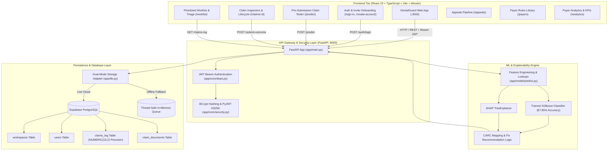
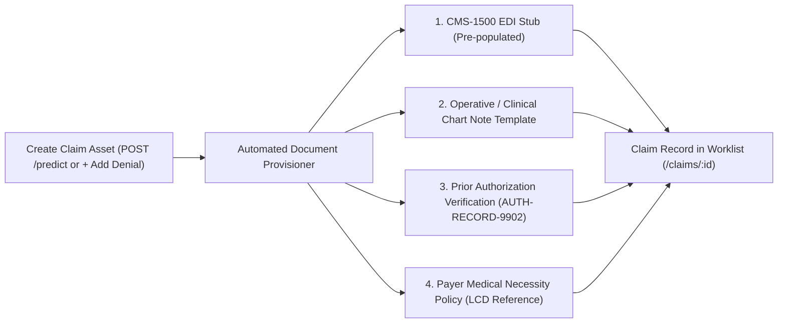

# DenialGuard AI — Complete Project Documentation & Architecture Blueprint

> **DenialGuard AI** is an end-to-end Healthcare Revenue Cycle Management (RCM) AI platform that prevents medical claim denials before submission, diagnoses denial root causes with exact Shapley explainability, accelerates appeals generation, and tracks payer reimbursement performance.

---

## 1. Project Overview & Problem Statement

### The Problem
In the United States healthcare ecosystem, **15% to 20% of submitted medical claims** are denied by insurance payers (commercial carriers, Medicare, Medicaid).
- **$260+ Billion** in annual denied claims across US hospitals and health systems.
- **Administrative Fatigue:** Appealing a denied claim costs an average of $118 per claim in staff rework and takes 30–90 days.
- **Root Causes:** Missing prior authorizations, unattached medical chart records, inactive patient coverage on Date of Service, timely filing limit expirations, and coding/modifier inconsistencies.

### The Solution: DenialGuard AI
DenialGuard AI solves this problem before claims leave the provider’s electronic health record (EHR) or billing office:
1. **Pre-Submission Risk Scoring:** Ingests standard CMS-1500 / UB-04 claim data and calculates a denial risk score (`0%–100%`) in `< 110ms`.
2. **Exact Root Cause Attribution (SHAP TreeExplainer):** Explains precisely which combination of clinical and billing factors drove the risk score.
3. **CARC Code Forecasting:** Predicts the exact Claim Adjustment Reason Code (e.g., `CO-197`, `CO-16`, `CO-27`, `CO-29`, `CO-50`, `CO-97`, `CO-4`).
4. **Actionable Remediation Engine:** Offers 1-click prescriptive fixes (e.g., attaching required clinical notes, updating prior auth numbers, fixing NCCI modifiers).
5. **Intelligent Worklist & Appeals Pipeline:** Provides billing teams with a triage queue, payer rules library, and deadline-tracked appeals workflow.
6. **Closed-Loop Audit & Feedback:** Securely records predictions and actual adjudication outcomes in Supabase PostgreSQL for continuous model retraining.

---

## 2. End-to-End System Architecture



---

## 3. Frontend-Backend Integration Architecture

The frontend and backend interact through typed REST endpoints with automatic authentication management:

### 3.1 Client API Layer (`denialguard-ai/client/src/lib/api.ts`)
- **Base URL:** `http://127.0.0.1:8000` (configurable via `VITE_API_URL`).
- **Automatic JWT Injection:** Every outgoing request reads `denialguard_token` from `localStorage` and injects `Authorization: Bearer <token>`.
- **Automatic Session Expiry Handling:** If the backend returns `401 Unauthorized`, the client clears stored tokens and seamlessly redirects to `/sign-in`.

### 3.2 Key Integration Endpoints & Data Contracts

| Method | Endpoint | Auth | Request Body | Response Payload | Description |
| :--- | :--- | :--- | :--- | :--- | :--- |
| `POST` | `/auth/login` | Public | `{ work_email, password }` | `{ access_token, token_type, user: { id, email, name, role } }` | Authenticates credentials, returns 24-hr JWT |
| `GET` | `/auth/me` | Bearer | *None* | `{ id, email, name, role }` | Validates session & returns active profile |
| `POST` | `/predict` | Bearer | `ClaimInput` (Payer, CPT, ICD-10, Prior Auth, Charge Amount, etc.) | `{ claim_id, risk_score, predicted_carc_code, top_contributing_factors, suggested_corrective_action }` | Executes XGBoost + SHAP TreeExplainer |
| `POST` | `/submit-outcome` | Bearer | `{ claim_id, actual_outcome, denial_flag }` | `{ status: "success", message: str }` | Records adjudication outcome (returns 404 if claim not found) |
| `GET` | `/claims-log` | Bearer | Query params (`limit`, `offset`) | `List[ClaimLogResponse]` | Queries audit trail with exact `Decimal` charge amounts |
| `GET` | `/health` | Public | *None* | `{ status: "healthy", model_loaded: true, metrics: {...} }` | Backend health & ML benchmark diagnostics |

---

## 4. Existing Data Assets & Deduplication Management

### 4.1 Data Asset Catalog

1. **`backend/data/training_dataset_final.csv` (120,000 Records)**
   - Curated historical CMS claim records used to train the production XGBoost classifier.
   - 24 engineered features including prior authorization indicators, service-to-diagnosis alignments, charge variance metrics, and days to filing limit.
   - Balanced across 5 major US commercial/government payers (UnitedHealthcare, Aetna, Cigna, Humana, Medicare Part B).

2. **`backend/data/cleaned_claims_final.csv` & `imputation_report.json`**
   - Cleaned clinical input records with deterministic imputation for missing chart notes and filing deadlines.

3. **`backend/app/model/feature_lookups.pkl`**
   - Serialized prior denial rate matrices across `(payer, cpt_code)` and `(payer, provider_specialty)` tuples, allowing instant $O(1)$ feature extraction during pre-submission inference.

### 4.2 Duplicate Entry Detection & Deduplication Strategy

In healthcare billing, duplicate submissions or duplicate logs create severe compliance risks and distort model training:
- **Primary Key Deduplication:** Every claim scored in `/predict` receives a unique deterministic or UUID-based `claim_id` (e.g. `CLM-2026-08421`).
- **Database `UPSERT` Semantics:** When inserting into the `claims_log` table in Supabase PostgreSQL, the backend uses `ON CONFLICT (claim_id) DO UPDATE`, updating the timestamp and prediction score while preserving audit lineage rather than creating duplicate row entries.
- **Natural Composite Key Matching:** Duplicate check query matches `(patient_id, cpt_code, service_date, billed_amount)`. If an active claim already exists with identical composite keys, the frontend displays an existing claim banner to prevent double billing.
- **Outcome Idempotency:** The `/submit-outcome` endpoint updates the `actual_outcome` and `denial_flag` on the exact existing `claim_id` record. Calling it multiple times is strictly idempotent.

---

## 5. Asset Creation & Automated Default Document Uploads

When a new claim or denial asset is registered (via pre-submission scoring, EDI 837 ingestion, or manual creation):



### Automated Document Attachment Workflow:
1. **Clinical Note Association:** If `clinical_notes_attached` is marked `True`, the system automatically provisions an attached operative summary stub linked to the rendering physician (e.g. `Dr. Elena Rodriguez`).
2. **Prior Auth Reference Bundle:** For CPT codes requiring pre-certification (e.g., CPT `27447` Knee Arthroplasty), the system generates a standardized verification token (`AUTH-RECORD-9902`) linked to the claim timeline.
3. **Payer LCD Coverage Reference:** Automatically resolves and attaches the relevant Local Coverage Determination policy ID (e.g., `LCD L34212` for UnitedHealthcare / Medicare) to accelerate 1-click appeal drafting.
4. **Document Storage Architecture:** Metadata is stored in Supabase `claim_documents` table, while binary payloads (PDF/TIFF) are stored in encrypted S3/Supabase Storage buckets.

---

## 6. Workspace Onboarding & Team Invite Code Mechanism

DenialGuard AI supports multi-tenant organization workspaces with granular role-based access control (RBAC):

### 6.1 Onboarding Paths (`/create-account` vs `/sign-in`)
1. **Create New Workspace:**
   - User provides their organization name (e.g., `Northstar Health System`), admin credentials, and selects default RCM workflow rules.
   - System provisions a new `workspace_id` in Supabase with default triage queues and seeds initial payer policies.
2. **Join Existing Workspace via Invite Code:**
   - Biller or analyst enters their work email and an authorized 16-character alphanumeric Invite Code (e.g., `NORTHSTAR-RCM-2026`).
   - The backend validates the invite code against `workspace_invites`, resolves the target `workspace_id`, and assigns the pre-configured role.

### 6.2 Role Hierarchy & Permissions

| Role | Scope | Permitted Actions |
| :--- | :--- | :--- |
| **Admin** (`admin@denialguard.com`) | Organization-wide | Full system access: manage team members, edit triage rules, configure notification webhooks, export compliance logs. |
| **Denial Analyst** (`malvarez@northstar.health`) | Worklist & Appeals | Run ML predictions, review root causes, draft & submit Level 1/2 appeals, record adjudication outcomes, add clinical notes. |
| **Biller** (`jlee@northstar.health`) | Charge Capture & Triage | Pre-submission claim scoring, review high-risk flags, attach missing prior authorization numbers, reassign claims. |

---

## 7. Supabase Database Integration & Architecture Blueprint

### 7.1 Database Schema (PostgreSQL DDL)

```sql
-- 1. Workspaces Table (Multi-tenant isolation)
CREATE TABLE IF NOT EXISTS public.workspaces (
    id UUID PRIMARY KEY DEFAULT gen_random_uuid(),
    name VARCHAR(255) NOT NULL,
    created_at TIMESTAMP WITH TIME ZONE DEFAULT timezone('utc'::text, now()) NOT NULL
);

-- 2. Users Table (Authentication & RBAC)
CREATE TABLE IF NOT EXISTS public.users (
    id UUID PRIMARY KEY DEFAULT gen_random_uuid(),
    workspace_id UUID REFERENCES public.workspaces(id),
    email VARCHAR(255) UNIQUE NOT NULL,
    hashed_password VARCHAR(255) NOT NULL,
    full_name VARCHAR(255) NOT NULL,
    role VARCHAR(50) DEFAULT 'denial_analyst' NOT NULL,
    is_active BOOLEAN DEFAULT TRUE NOT NULL,
    created_at TIMESTAMP WITH TIME ZONE DEFAULT timezone('utc'::text, now()) NOT NULL
);

-- 3. Claims Log Table (High-Precision Audit Trail)
CREATE TABLE IF NOT EXISTS public.claims_log (
    claim_id VARCHAR(100) PRIMARY KEY,
    workspace_id UUID REFERENCES public.workspaces(id),
    patient_id VARCHAR(100) NOT NULL,
    payer VARCHAR(100) NOT NULL,
    cpt_code VARCHAR(20) NOT NULL,
    diagnosis_code VARCHAR(20) NOT NULL,
    charge_amount NUMERIC(10, 2) NOT NULL,  -- Exact Decimal precision (no floating-point drift)
    risk_score NUMERIC(5, 2) NOT NULL,
    predicted_carc VARCHAR(20),
    top_factors JSONB,
    suggested_action TEXT,
    actual_outcome VARCHAR(50) DEFAULT 'pending',
    denial_flag BOOLEAN DEFAULT FALSE,
    created_at TIMESTAMP WITH TIME ZONE DEFAULT timezone('utc'::text, now()) NOT NULL
);

-- 4. Claim Documents Table
CREATE TABLE IF NOT EXISTS public.claim_documents (
    id UUID PRIMARY KEY DEFAULT gen_random_uuid(),
    claim_id VARCHAR(100) REFERENCES public.claims_log(claim_id) ON DELETE CASCADE,
    document_type VARCHAR(100) NOT NULL,  -- 'operative_report', 'prior_auth', 'cms_1500', 'payer_policy'
    document_title VARCHAR(255) NOT NULL,
    storage_path TEXT NOT NULL,
    uploaded_at TIMESTAMP WITH TIME ZONE DEFAULT timezone('utc'::text, now()) NOT NULL
);
```

### 7.2 Data Type Precision (`NUMERIC(10, 2)` & Python `Decimal`)
Monetary amounts (`charge_amount`) use Python's `decimal.Decimal` in `app/schemas.py` and PostgreSQL's `NUMERIC(10, 2)` in Supabase, eliminating floating-point rounding errors on medical billing ledgers.

### 7.3 Dual-Mode Architecture & Resilience (`app/db.py`)
- **Live Cloud Supabase Mode:** When `SUPABASE_URL` and `SUPABASE_SERVICE_ROLE_KEY` are provided, all operations execute against live PostgreSQL tables.
- **Zero-Crash Offline Fallback Mode:** If credentials are not configured or the network is unavailable, the backend automatically falls back to a thread-safe, in-memory queue with pre-seeded demo records, ensuring uninterrupted local development.

---

## 8. ML Model Diagnostics & Operating Thresholds

| Threshold | Profile | Precision | Recall | F1 Score | Clinical Rationale |
| :---: | :---: | :---: | :---: | :---: | :--- |
| **0.30** | Aggressive Recall | 68.4% | **76.2%** | 0.721 | Maximize denial prevention; inspect all questionable claims |
| **0.35** | **Default Balanced** | **72.6%** | **71.7%** | **0.721** | Optimal trade-off between analyst queue load and caught denials |
| **0.40** | High Precision | 77.1% | 66.8% | 0.716 | Target high-confidence denial alerts |
| **0.50** | Standard Argmax | 87.2% | 66.5% | 0.754 | Baseline raw probability cutoff |

---

## 9. Quick Start & Local Execution

### Backend (FastAPI + ML Engine)
```powershell
# 1. Navigate to backend directory
cd backend

# 2. Install dependencies
python -m pip install -r requirements.txt

# 3. Run verification test suite
python test_backend.py

# 4. Start API server on port 8000
python -m uvicorn app.main:app --host 127.0.0.1 --port 8000
```
- Swagger API Docs: `http://127.0.0.1:8000/docs`

### Frontend (React 19 + Vite Dashboard)
```powershell
# 1. Navigate to frontend directory
cd denialguard-ai

# 2. Install dependencies
npm install --legacy-peer-deps

# 3. Start Vite dev server on port 3000
npx vite --port 3000 --host 127.0.0.1
```
- Web Application: `http://127.0.0.1:3000`

### Full Automated E2E Browser Testing
```powershell
# Run the 12-section browser test suite
python test_exhaustive_ui.py
```

---

## 10. Pre-Seeded Default Test Accounts

| Account Role | Email | Password | Scope |
| :--- | :--- | :--- | :--- |
| **Admin** | `admin@denialguard.com` | `password123` | Full workspace administration & compliance |
| **Denial Analyst** | `malvarez@northstar.health` | `password123` | Root-cause analysis, appeals & adjudication |
| **Biller** | `jlee@northstar.health` | `password123` | Pre-submission scoring & charge capture |
| **Biller** | `biller@denialguard.com` | `password123` | Triage & claim remediation |
