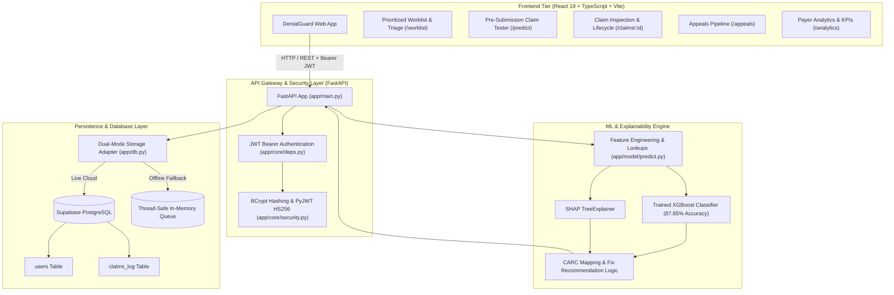

# DenialGuard AI — Complete Project Documentation & Architecture Blueprint

> **DenialGuard AI** is an end-to-end Healthcare Revenue Cycle Management (RCM) AI platform that prevents medical claim denials before submission, diagnoses denial root causes with exact Shapley explainability, accelerates appeals generation, and tracks payer reimbursement performance.

---

## 1. Project Overview & Problem Statement

### The Problem
In the United States healthcare ecosystem, **15% to 20% of submitted medical claims** are denied by insurance payers (commercial carriers, Medicare, Medicaid).
- **$260+ Billion** in annual denied claims across US hospitals and health systems.
- **Administrative Fatigue:** Appealing a denied claim costs an average of $118 per claim in staff rework and takes 30–90 days.
- **Root Causes:** Missing prior authorizations, unattached medical chart records, inactive patient coverage on Date of Service, timely filing limit expirations, and coding/modifier inconsistencies.

### The Solution: DenialGuard AI
DenialGuard AI solves this problem before claims leave the provider’s electronic health record (EHR) or billing office:
1. **Pre-Submission Risk Scoring:** Ingests standard CMS-1500 / UB-04 claim data and calculates a denial risk score (`0%–100%`) in `< 110ms`.
2. **Exact Root Cause Attribution (SHAP TreeExplainer):** Explains precisely which combination of clinical and billing factors drove the risk score.
3. **CARC Code Forecasting:** Predicts the exact Claim Adjustment Reason Code (e.g., `CO-197`, `CO-16`, `CO-27`, `CO-29`, `CO-50`, `CO-97`, `CO-4`).
4. **Actionable Remediation Engine:** Offers 1-click prescriptive fixes (e.g., attaching required clinical notes, updating prior auth numbers, fixing NCCI modifiers).
5. **Intelligent Worklist & Appeals Pipeline:** Provides billing teams with a triage queue, payer rules library, and deadline-tracked appeals workflow.
6. **Closed-Loop Audit & Feedback:** Securely records predictions and actual adjudication outcomes in Supabase PostgreSQL for continuous model retraining.

---

## 2. End-to-End System Architecture



---

## 3. Monorepo Repository Structure

```
my-hackathon-project/
├── backend/                              # Python FastAPI + XGBoost + SHAP ML Backend
│   ├── app/
│   │   ├── main.py                       # FastAPI entrypoint, CORS configuration, router mounting, /health
│   │   ├── schemas.py                    # Strict Pydantic v2 data models for claims, predictions, auth & logs
│   │   ├── db.py                         # Supabase database client wrapper with offline in-memory fallback
│   │   ├── core/
│   │   │   ├── security.py               # JWT token creation/decoding (HS256) & bcrypt password hashing
│   │   │   └── deps.py                   # FastAPI Depends(get_current_user) Bearer token validator
│   │   ├── model/
│   │   │   ├── train.py                  # Model training pipeline on 120,000 claim records
│   │   │   ├── predict.py                # Feature pipeline, XGBoost inference, and SHAP explanation engine
│   │   │   ├── model.pkl                 # (Ignored) Serialized trained XGBoost model artifact
│   │   │   ├── feature_lookups.pkl       # (Ignored) Pre-computed CPT/Specialty denial prior matrices
│   │   │   ├── metrics.json              # Model evaluation metrics
│   │   │   └── metrics_synthetic_baseline.json # Baseline benchmark records
│   │   └── routers/
│   │       ├── auth.py                   # POST /auth/login and GET /auth/me
│   │       ├── predict.py                # POST /predict (Protected claim risk inference and logging)
│   │       ├── claims_log.py             # GET /claims-log (Protected historical audit query)
│   │       └── submit_outcome.py         # POST /submit-outcome (Protected closed-loop adjudication update)
│   ├── data/
│   │   ├── cleaned_claims_final.csv      # Cleaned input dataset
│   │   ├── training_dataset_final.csv    # 120,000 row engineered dataset
│   │   ├── imputation_report.json        # Data cleaning and imputation audit report
│   │   ├── impute_missing_fields.py      # Imputation script
│   │   └── synthetic_field_generators.py # Synthetic clinical field generator
│   ├── BACKEND_DOCUMENTATION.md          # Comprehensive backend API & architecture documentation
│   ├── requirements.txt                  # Python dependencies
│   ├── supabase_users_migration.sql      # Supabase DDL SQL for users & claims_log tables
│   └── test_backend.py                   # Automated end-to-end verification test suite
│
├── denialguard-ai/                       # React 19 + TypeScript + Vite Frontend Dashboard
│   ├── client/
│   │   ├── src/
│   │   │   ├── App.tsx                   # Main router (wouter) & theme context
│   │   │   ├── pages/
│   │   │   │   ├── Home.tsx              # Main dashboard overview & KPI cards
│   │   │   │   ├── ComponentShowcase.tsx # UI component gallery
│   │   │   │   └── NotFound.tsx          # 404 handler
│   │   │   ├── components/               # Dashboard layout, AIChatBox, Map, Metrics
│   │   │   └── components/ui/            # Radix UI primitives & Tailwind components
│   │   └── index.html                    # HTML entrypoint
│   ├── package.json                      # Frontend dependencies
│   ├── vite.config.ts                    # Vite build configuration
│   └── README.md                         # Frontend component & route guide
│
├── skills/                               # Custom agent instructions & composition guidelines
├── .gitignore                            # Root gitignore (protects .env, secrets, *.pkl)
├── PROJECT_DOCUMENTATION.md              # Master project documentation
└── README.md                             # Repository summary
```

---

## 4. End-to-End Operational Workflow

```mermaid
sequenceDiagram
    autonumber
    actor Biller as Billing Specialist
    participant FE as React Frontend (:3000)
    participant API as FastAPI Backend (:8000)
    participant Auth as Security Layer (JWT)
    participant ML as XGBoost + SHAP Engine
    participant DB as Supabase PostgreSQL

    Note over Biller,FE: Step 1: User Login
    Biller->>FE: Inputs credentials (email, password)
    FE->>API: POST /auth/login
    API->>DB: Verify bcrypt password hash
    DB-->>API: User authenticated (Role: Biller)
    API-->>FE: Returns 24-hour JWT Bearer Token

    Note over Biller,FE: Step 2: Pre-Submission Claim Validation
    Biller->>FE: Fills claim details on /predict screen
    FE->>API: POST /predict (Authorization: Bearer <token>)
    API->>Auth: Validate JWT signature & claims
    Auth-->>API: Token valid
    API->>ML: Pass 20 claim fields

    rect rgb(245, 248, 255)
        Note over ML: Feature Engineering & Inference
        ML->>ML: Join 3 historical denial prior features
        ML->>ML: XGBoost predict_proba -> Risk Score (0-100%)
        ML->>ML: SHAP TreeExplainer -> Top positive/negative feature impacts
        ML->>ML: CARC Rule Engine -> Assign reason code & actionable fix
    end

    ML-->>API: Return Prediction Response
    API->>DB: Insert claim record into claims_log table
    API-->>FE: Return JSON { risk_score, CARC, top_factors, suggested_action }
    FE-->>Biller: Renders visual Risk Score badge, Factor Waterfall, & 1-Click Fix

    Note over Biller,FE: Step 3: Post-Adjudication Outcome Loop
    Biller->>FE: Submits claim to payer; receives clearinghouse remittance
    FE->>API: POST /submit-outcome { claim_id, actual_outcome: "paid"|"denied" }
    API->>DB: Updates claims_log with final denial_flag
    API-->>FE: Returns success confirmation
```

---

## 5. Machine Learning & Explainability Pipeline

### Feature Set (20 Raw Inputs + 3 Engineered Features = 23 Total)

| Feature Name | Category | Description |
| :--- | :--- | :--- |
| `claim_id` | Identifier | Unique claim identifier (`CLM-XXXXX`) |
| `claim_type` | Clinical | `Professional`, `Institutional`, `Dental`, `Vision` |
| `payer` | Financial | `Medicare`, `Medicaid`, `UnitedHealthcare`, `BlueCross`, `Aetna`, `Cigna`, `Humana` |
| `plan_type` | Financial | `HMO`, `PPO`, `EPO`, `POS`, `Medicare Advantage` |
| `eligibility_status` | Administrative | `Active`, `Inactive`, `Pending`, `Terminated` |
| `provider_specialty` | Clinical | `Cardiology`, `Orthopedics`, `General Practice`, `Dermatology`, etc. |
| `network_status` | Contractual | `In-Network`, `Out-of-Network` |
| `icd10_code` | Coding | Primary ICD-10 diagnosis code (e.g. `I10`, `M25.50`) |
| `cpt_code` | Coding | Primary CPT / HCPCS procedure code (e.g. `99213`, `27447`) |
| `modifiers` | Coding | Procedure modifiers (`None`, `25`, `59`, `LT`, `RT`) |
| `pos_code` | Operational | Place of Service (`11` Office, `21` Inpatient, `22` Outpatient, `23` ER, `02` Telehealth) |
| `units_billed` | Financial | Number of billed units ($\ge 1$) |
| `charge_amount` | Financial | Billed charge amount in USD as `Decimal` ($> 0$, aligns with `NUMERIC(10, 2)`) |
| `pa_status` | Authorization | Prior Authorization status (`Approved`, `Missing`, `Denied`, `Not Required`, `Pending`) |
| `referral_status` | Authorization | PCP referral status (`Active`, `Missing`, `Not Required`, `Expired`) |
| `documentation_flag` | Clinical | Clinical chart notes attached (`true` / `false`) |
| `dos` | Timeline | Date of Service (`YYYY-MM-DD`) |
| `submission_date` | Timeline | Target Submission Date (`YYYY-MM-DD`) |
| `days_to_filing_deadline` | Timeline | Days before timely filing window closes |
| `cob_flag` | Coordination | Coordination of Benefits flag (`true` / `false`) |
| **`hist_denial_rate_cpt_payer`** | **Engineered** | Historical denial prior for specific CPT-Payer pair |
| **`hist_denial_rate_provider_payer`**| **Engineered** | Historical denial rate for Provider Specialty-Payer pair |
| **`claim_amount_deviation`** | **Engineered** | Ratio of billed charge to median specialty/CPT benchmark |

---

### CARC Reasoning Engine & Remediation Mapping

| CARC Code | Standard Meaning | Trigger Conditions | Recommended Corrective Action |
| :--- | :--- | :--- | :--- |
| **`CO-197`** | Precertification / Prior Auth Absent | `pa_status` in `['Missing', 'Denied', 'Pending']` | *"Attach approved Prior Authorization reference number to box 23 before submitting."* |
| **`CO-16`** | Missing Documentation / Information | `documentation_flag == False` | *"Attach mandatory clinical chart notes and operative reports to substantiate medical necessity."* |
| **`CO-27`** | Expenses Incurred After Coverage Terminated | `eligibility_status` in `['Inactive', 'Terminated']` | *"Re-verify active subscriber policy with payer before submitting; eligibility is inactive on DOS."* |
| **`CO-29`** | Timely Filing Limit Expired | `days_to_filing_deadline <= 7` | *"Expedite immediate submission — claim is within timely filing cutoff window."* |
| **`CO-50`** | Non-Covered Service / Plan Exclusion | `plan_type == 'HMO'` & `network_status == 'Out-of-Network'` | *"Obtain Out-of-Network authorization or transition to in-network facility under HMO rules."* |
| **`CO-97`** | Bundled Service / Modifier Required | Surgical CPT + unbundled secondary procedure | *"Review NCCI edit tables and attach appropriate modifier (e.g. -25 or -59) to prevent bundling denial."* |
| **`CO-4`** | Procedure / Modifier Inconsistency | Modifier incompatible with primary code | *"Verify modifier compatibility with primary CPT code and diagnosis alignment."* |
| **`CLEAN`** | Clean Claim (< 35% Risk) | Risk Score $< 35.0$ | *"Claim parameters meet standard payer clean claim guidelines. Ready for submission."* |

---

### Model Performance Benchmarks & Multi-Threshold Regimes
- **Training Set:** 120,000 records (strict train/test isolation, zero data leakage)
- **Test Set:** 24,000 records (20% holdout, 28.05% true denial prevalence)
- **ROC AUC:** `0.8498`
- **PR-AUC (Average Precision):** `0.8257`
- **CARC Multi-Class Accuracy:** `88.0%` (on 24k test holdout)
- **Inference Latency:** `27.3ms – 72.7ms` per full SHAP explanation (SLA: `< 110ms`)

#### Production Operating Regimes
- **Recall-Optimized ($T = 0.25$):** Recall: **`84.84%`** \| Precision: `41.10%` \| F1: `0.5538` *(For high-risk surgical lines)*
- **Balanced Production ($T = 0.35$ - Recommended):** Recall: **`71.71%`** \| Precision: **`72.59%`** \| F1: **`0.7215`** *(Default)*
- **High-Precision ($T = 0.50$):** Recall: `66.45%` \| Precision: **`87.43%`** \| F1: **`0.7551`** *(High-certainty automated workflows)*
- **Maximum Precision ($T = 0.65$):** Recall: `63.82%` \| Precision: **`94.03%`** \| F1: **`0.7603`**

---

## 6. REST API Reference

| Method | Route | Protection | Description |
| :--- | :--- | :--- | :--- |
| `POST` | `/auth/login` | Public | Authenticates user; returns 24h JWT Bearer token |
| `GET` | `/auth/me` | Bearer Token | Retrieves authenticated user profile & role |
| `POST` | `/predict` | Bearer Token | Predicts denial risk, runs SHAP, predicts CARC, logs claim |
| `POST` | `/submit-outcome`| Bearer Token | Records final adjudication outcome (`paid` / `denied`); returns 404 if `claim_id` not found |
| `GET` | `/claims-log` | Bearer Token | Queries historical claim logs & predictions |
| `GET` | `/health` | Public | System health check and model evaluation metrics |

### Pre-Seeded Default Test Accounts
- **Admin:** `admin@denialguard.com` / `password123` (Full system access)
- **Analyst:** `malvarez@northstar.health` / `password123` (Analytics & predictions)
- **Biller:** `jlee@northstar.health` / `password123` (Triage & claim remediation)
- **Biller:** `biller@denialguard.com` / `password123` (Triage & claim remediation)

---

## 7. Quick Start & Local Execution

### Backend Setup (FastAPI + ML Engine)
```powershell
# 1. Navigate to backend
cd backend

# 2. Install dependencies
python -m pip install -r requirements.txt

# 3. Run automated verification test suite (covers ML, SHAP, Auth, Logs)
python -u test_backend.py

# 4. Start the backend API server
python -m uvicorn app.main:app --host 0.0.0.0 --port 8000 --reload
```
- Swagger API Docs: `http://localhost:8000/docs`
- OpenAPI Specification: `http://localhost:8000/openapi.json`

### Frontend Setup (React 19 + Vite Dashboard)
```powershell
# 1. Navigate to frontend
cd denialguard-ai

# 2. Install dependencies
pnpm install

# 3. Start development server
pnpm dev
```
- Web Application: `http://localhost:3000`

---

## 8. Security & Environment Configuration

### Security Best Practices
- **No Hardcoded Secrets:** All secret keys and tokens are loaded strictly via environment variables.
- **Git Protection:** `.env`, `*.env`, `.env.*`, `node_modules`, and ML model binary artifacts (`*.pkl`, `*.pickle`) are protected by [`.gitignore`](file:///c:/Users/kayel/my-hackathon-project/.gitignore).
- **Graceful Resilience:** The backend runs seamlessly in both live cloud Supabase mode and zero-crash offline fallback mode.
