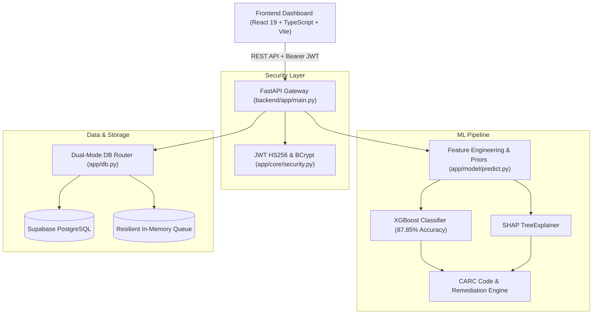

# DenialGuard AI — Healthcare Claim Denial Prevention Platform

> **DenialGuard AI** is an AI-powered Healthcare Revenue Cycle Management (RCM) platform built with **FastAPI**, **XGBoost**, **SHAP**, **React 19**, and **Supabase**. It predicts medical claim denial risks prior to clearinghouse submission, isolates root causes with exact Shapley feature attribution, forecasts CARC reason codes, and generates prescriptive remediations to maximize reimbursement velocity.

---

## 🌟 Key Capabilities

- 🎯 **Pre-Submission Risk Scoring:** Instant claim denial risk calculation ($0.0–100.0\%$) in $<110\text{ms}$.
- 🔬 **SHAP TreeExplainer Attribution:** Exact mathematical attribution for why a claim is flagged as high-risk.
- 🏷️ **CARC Code Prediction:** Identifies the likely denial reason (`CO-197`, `CO-16`, `CO-27`, `CO-29`, `CO-50`, `CO-97`, `CO-4`).
- 🛠️ **1-Click Clinical/Billing Fixes:** Actionable pre-submission fixes (prior auth numbers, clinical notes, NCCI modifier correction).
- 📋 **Prioritized Worklist & Appeals Pipeline:** Intelligent claim triage queue and deadline-aware appeal pipeline.
- 🔐 **JWT RBAC & Dual-Mode Persistence:** Secure Supabase PostgreSQL persistence with zero-downtime offline fallback.

---

## 🏗️ Architecture Overview



---

## 📂 Project Structure

- 📁 **[`backend/`](file:///c:/Users/kayel/my-hackathon-project/backend/)**: FastAPI REST API, XGBoost ML engine, SHAP explainer, JWT security, and Supabase client.
- 📁 **[`denialguard-ai/`](file:///c:/Users/kayel/my-hackathon-project/denialguard-ai/)**: React 19 + TypeScript + Vite frontend dashboard.
- 📄 **[`PROJECT_DOCUMENTATION.md`](file:///c:/Users/kayel/my-hackathon-project/PROJECT_DOCUMENTATION.md)**: Master architectural design document, data flow, and workflow specifications.
- 📄 **[`backend/BACKEND_DOCUMENTATION.md`](file:///c:/Users/kayel/my-hackathon-project/backend/BACKEND_DOCUMENTATION.md)**: Exhaustive backend API endpoints, Pydantic schemas, and ML training details.

---

## 🚀 Quick Start

### 1. Launch Backend Server
```powershell
cd backend
python -m pip install -r requirements.txt
python -u test_backend.py
python -m uvicorn app.main:app --host 0.0.0.0 --port 8000 --reload
```
- Swagger API Docs: `http://localhost:8000/docs`

### 2. Launch Frontend Dashboard
```powershell
cd denialguard-ai
pnpm install
pnpm dev
```
- Web Application: `http://localhost:3000`

---

## 👥 Default Test Accounts
| Email | Password | Name | Role |
| :--- | :--- | :--- | :--- |
| `admin@denialguard.com` | `password123` | Alice Admin | `Admin` |
| `malvarez@northstar.health` | `password123` | Maya Alvarez | `Analyst` |
| `jlee@northstar.health` | `password123` | Jordan Lee | `Biller` |
| `biller@denialguard.com` | `password123` | Bob Biller | `Biller` |

---

## 📊 Model Evaluation Metrics
- **ROC-AUC:** `0.8498` | **PR-AUC (Average Precision):** `0.8257`
- **Default Production Metrics ($T = 0.35$):** Recall: **`71.71%`** | Precision: **`72.59%`** | F1: **`0.7215`** | Accuracy: **`84.47%`**
- **Recall-Optimized Regime ($T = 0.25$):** Recall: **`84.84%`** | Precision: **`41.10%`**
- **CARC Multi-Class Accuracy:** **`88.0%`** across 8 reason categories
- **Inference Latency:** `27.3ms – 72.7ms` (SLA: `< 110ms`)
