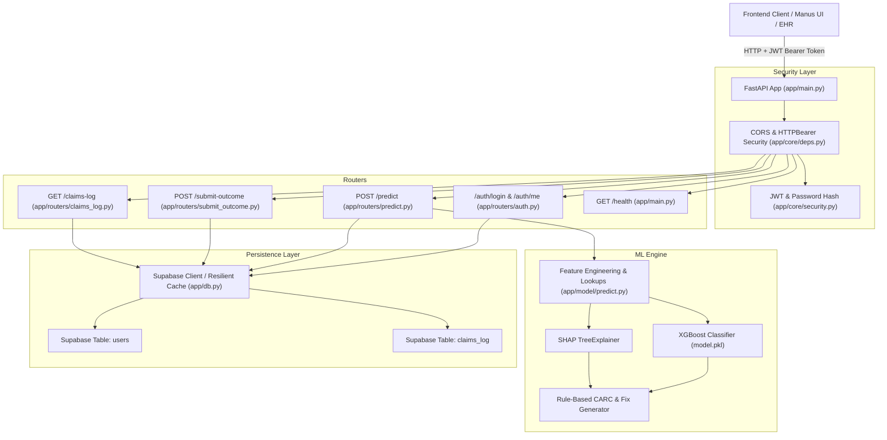

# DenialGuard AI — Complete Backend Architecture & API Specification

> **DenialGuard AI** is a production-grade AI/ML backend built with **FastAPI**, **XGBoost**, and **SHAP**. It predicts US healthcare claim denial probabilities (0–100%) prior to clearinghouse submission, isolates root causes using exact Shapley feature attribution, forecasts likely Claim Adjustment Reason Codes (CARC), suggests clinical/billing remediations, and provides JWT-authenticated audit logging backed by Supabase.

---

## 1. System Architecture & Tech Stack



### Core Technologies
- **API Framework:** FastAPI `>=0.110.0`, Uvicorn `>=0.28.0`
- **Machine Learning:** XGBoost `>=2.0.0`, Scikit-learn `>=1.4.0`, NumPy, Pandas
- **Explainability:** SHAP `>=0.45.0` (`TreeExplainer` with margin link)
- **Authentication:** PyJWT `>=2.8.0`, Passlib/BCrypt (HS256, 24-hour token expiry)
- **Data Validation:** Pydantic v2 (`pydantic>=2.6.0`, `pydantic-settings>=2.2.0`)
- **Database:** Supabase PostgreSQL (`supabase>=2.3.0`) + In-Memory Fallback Cache

---

## 2. Directory Structure & File Map

```
backend/
├── app/
│   ├── __init__.py               # App package initializer
│   ├── main.py                   # FastAPI application entrypoint, CORS, router mounting, /health
│   ├── db.py                     # Supabase client wrapper, user store, claims_log CRUD, offline fallback
│   ├── schemas.py                # Strict Pydantic models for claim inputs, outputs, auth, and logs
│   ├── core/
│   │   ├── __init__.py           # Core security package initializer
│   │   ├── security.py           # JWT creation/decoding (HS256) & bcrypt password hashing
│   │   └── deps.py               # FastAPI Depends(get_current_user) Bearer token validator
│   ├── model/
│   │   ├── __init__.py           # Model package initializer
│   │   ├── train.py              # Synthetic training script (120,000 claim records)
│   │   ├── predict.py            # Feature engineering, XGBoost inference, and SHAP explanation
│   │   ├── model.pkl             # Serialized trained XGBoost model
│   │   ├── feature_lookups.pkl   # Pre-computed historical denial priors & specialty deviations
│   │   ├── metrics.json          # Production model evaluation metrics
│   │   └── metrics_synthetic_baseline.json # Baseline benchmark records
│   └── routers/
│       ├── __init__.py           # Routers package initializer
│       ├── auth.py               # POST /auth/login and GET /auth/me
│       ├── predict.py            # POST /predict (protected)
│       ├── claims_log.py         # GET /claims-log (protected)
│       └── submit_outcome.py     # POST /submit-outcome (protected)
├── data/                         # Training data caches and lookup matrices
├── .env.example                  # Template of required environment variables
├── requirements.txt              # Production Python package dependencies
├── supabase_users_migration.sql  # SQL DDL script for Supabase users table & seed accounts
└── test_backend.py               # Verification test suite covering ML, SHAP, auth, and logs
```

---

## 3. User Authentication & Security Strategy

### Authentication Flow
1. **User Sign In (`POST /auth/login` or `POST /login`):**
   - User submits `work_email` and `password`.
   - The backend checks Supabase `users` table (or local resilient store).
   - Validates password using bcrypt.
   - Signs and returns a 24-hour JWT Bearer token along with user context (`email`, `name`, `role`).
2. **Session Restoration (`GET /auth/me` or `GET /me`):**
   - Frontend passes `Authorization: Bearer <token>`.
   - Resolves and verifies user payload.
3. **Route Protection:**
   - Critical routes (`/predict`, `/claims-log`, `/submit-outcome`) inject `current_user: dict = Depends(get_current_user)`.
   - Missing or expired tokens immediately trigger `401 Unauthorized` with `WWW-Authenticate: Bearer`.

### Pre-Seeded Default Test Accounts
| Email | Password | Name | Role |
| :--- | :--- | :--- | :--- |
| `admin@denialguard.com` | `password123` | Alice Admin | `Admin` |
| `malvarez@northstar.health` | `password123` | Maya Alvarez | `Analyst` |
| `jlee@northstar.health` | `password123` | Jordan Lee | `Biller` |
| `biller@denialguard.com` | `password123` | Bob Biller | `Biller` |

---

## 4. Machine Learning & Explainability Pipeline

### Feature Set (20 Raw Inputs + 3 Engineered Features)
The inference engine consumes 20 standard CMS-1500 / UB-04 claim fields:
1. `claim_type`: `Professional`, `Institutional`, `Dental`, `Vision`
2. `payer`: `Medicare`, `Medicaid`, `UnitedHealthcare`, `BlueCross`, `Aetna`, `Cigna`, `Humana`
3. `plan_type`: `HMO`, `PPO`, `EPO`, `POS`, `Medicare Advantage`
4. `eligibility_status`: `Active`, `Inactive`, `Pending`, `Terminated`
5. `provider_specialty`: `Cardiology`, `Orthopedics`, `General Practice`, `Dermatology`, etc.
6. `network_status`: `In-Network`, `Out-of-Network`
7. `icd10_code`: ICD-10 diagnosis code (e.g. `I10`, `E11.9`, `M54.5`)
8. `cpt_code`: CPT procedure code (e.g. `99213`, `99214`, `27447`)
9. `modifiers`: Modifiers applied (e.g. `25`, `59`, `LT`, `RT`, `None`)
10. `pos_code`: Place of Service code (e.g. `11` Office, `21` Inpatient, `22` Outpatient, `23` ER, `02` Telehealth)
11. `units_billed`: Integer units billed (ge: 1)
12. `charge_amount`: Total billed charge amount ($USD)
13. `pa_status`: Prior Authorization status (`Approved`, `Missing`, `Denied`, `Not Required`, `Pending`)
14. `referral_status`: Referral status (`Active`, `Missing`, `Not Required`, `Expired`)
15. `documentation_flag`: Boolean (`True` if clinical notes/charts are attached)
16. `dos`: Date of Service (`YYYY-MM-DD`)
17. `submission_date`: Claim Submission Date (`YYYY-MM-DD`)
18. `days_to_filing_deadline`: Integer days before payer filing deadline expires
19. `cob_flag`: Boolean Coordination of Benefits flag
20. `claim_id`: Unique identifier (auto-generated as `CLM-XXXXXXXX` if omitted)

#### 3 Engineered Features:
- `hist_denial_rate_cpt_payer`: Historical denial prior for the specific CPT-Payer pairing.
- `hist_denial_rate_provider_payer`: Historical denial rate for the Provider Specialty-Payer combination.
- `claim_amount_deviation`: Ratio of billed `charge_amount` against the median benchmark for that procedure code and specialty.

### SHAP TreeExplainer & Remediation Engine
- Computes exact local Shapley values for each inference.
- Translates top negative/positive features into human-readable billing explanations (e.g. "Missing prior authorization", "Expenses incurred after coverage terminated").
- Maps predicted risk to specific CARC codes (`CO-197`, `CO-16`, `CO-27`, `CO-29`, `CO-50`, `CO-97`, `CO-4`) and generates targeted pre-submission corrective actions.

### Model Performance Metrics (`metrics.json`)
- **Dataset Size:** 120,000 records (80/20 train/test split)
- **Accuracy:** `87.85%`
- **F1 Score:** `0.7543`
- **Precision:** `87.17%`
- **Recall:** `66.48%`
- **ROC AUC:** `0.8497`
- **Latency:** `< 110ms` per full SHAP prediction (well below the 2-second target).

---

## 5. Database Architecture (Supabase)

### Table: `users`
```sql
CREATE TABLE users (
    id UUID PRIMARY KEY DEFAULT gen_random_uuid(),
    work_email TEXT UNIQUE NOT NULL,
    password_hash TEXT NOT NULL,
    name TEXT NOT NULL,
    role TEXT NOT NULL CHECK (role IN ('Biller', 'Analyst', 'Admin', 'Read-only')),
    created_at TIMESTAMPTZ DEFAULT now()
);
CREATE INDEX idx_users_work_email ON users(LOWER(work_email));
```

### Table: `claims_log`
```sql
CREATE TABLE claims_log (
    id UUID PRIMARY KEY DEFAULT gen_random_uuid(),
    claim_id TEXT UNIQUE NOT NULL,
    claim_type TEXT,
    payer TEXT,
    plan_type TEXT,
    eligibility_status TEXT,
    provider_specialty TEXT,
    network_status TEXT,
    icd10_code TEXT,
    cpt_code TEXT,
    modifiers TEXT,
    pos_code TEXT,
    units_billed INT,
    charge_amount NUMERIC(10, 2),
    pa_status TEXT,
    referral_status TEXT,
    documentation_flag BOOLEAN,
    dos DATE,
    submission_date DATE,
    days_to_filing_deadline INT,
    cob_flag BOOLEAN,
    hist_denial_rate_cpt_payer NUMERIC(5, 4),
    hist_denial_rate_provider_payer NUMERIC(5, 4),
    claim_amount_deviation NUMERIC(6, 2),
    predicted_risk_score NUMERIC(5, 2),
    predicted_carc_code TEXT,
    top_contributing_factors JSONB,
    suggested_corrective_action TEXT,
    actual_outcome TEXT,
    denial_flag BOOLEAN,
    created_at TIMESTAMPTZ DEFAULT now()
);
CREATE INDEX idx_claims_log_created_at ON claims_log(created_at DESC);
CREATE INDEX idx_claims_log_claim_id ON claims_log(claim_id);
```

### Resilience & Offline Mode
If `SUPABASE_URL` or `SUPABASE_SERVICE_ROLE_KEY` are not configured or the remote database is unreachable:
- Database operations gracefully fallback to an in-memory thread-safe queue.
- API requests remain 100% operational without crashing.

---

## 6. Complete API Reference

### 6.1 Authentication Endpoints

#### `POST /auth/login` (or `/login`)
Authenticate user credentials and receive a JWT Bearer token.

**Request Body:**
```json
{
  "work_email": "admin@denialguard.com",
  "password": "password123"
}
```

**Response (200 OK):**
```json
{
  "access_token": "eyJhbGciOiJIUzI1NiIsInR5cCI6IkpXVCJ9...",
  "token_type": "bearer",
  "user": {
    "email": "admin@denialguard.com",
    "name": "Alice Admin",
    "role": "Admin"
  }
}
```

#### `GET /auth/me` (or `/me`)
Retrieve current user session from Bearer token.

**Headers:**
`Authorization: Bearer <access_token>`

**Response (200 OK):**
```json
{
  "email": "admin@denialguard.com",
  "name": "Alice Admin",
  "role": "Admin"
}
```

---

### 6.2 ML Prediction & Risk Explanation

#### `POST /predict`
Predict claim denial risk, compute SHAP feature importance, predict CARC reason code, and return suggested corrective action.

**Headers:**
`Authorization: Bearer <access_token>`

**Request Body:**
```json
{
  "claim_id": "CLM-2026-08397",
  "claim_type": "Institutional",
  "payer": "UnitedHealthcare",
  "plan_type": "HMO",
  "eligibility_status": "Inactive",
  "provider_specialty": "Orthopedics",
  "network_status": "Out-of-Network",
  "icd10_code": "M25.50",
  "cpt_code": "27447",
  "modifiers": "None",
  "pos_code": "21",
  "units_billed": 1,
  "charge_amount": 5200.00,
  "pa_status": "Missing",
  "referral_status": "Missing",
  "documentation_flag": false,
  "dos": "2026-06-01",
  "submission_date": "2026-08-25",
  "days_to_filing_deadline": 5,
  "cob_flag": false
}
```

**Response (200 OK):**
```json
{
  "claim_id": "CLM-2026-08397",
  "risk_score": 100.0,
  "predicted_carc_code": "CO-27",
  "top_contributing_factors": [
    {
      "feature": "Clinical Documentation Attached",
      "impact": 8.2101,
      "direction": "increases_risk"
    },
    {
      "feature": "Patient Eligibility Status",
      "impact": 0.7168,
      "direction": "increases_risk"
    },
    {
      "feature": "Referral Status",
      "impact": 0.2897,
      "direction": "increases_risk"
    },
    {
      "feature": "Charge Amount Variance",
      "impact": 0.1851,
      "direction": "increases_risk"
    }
  ],
  "suggested_corrective_action": "Expenses incurred after coverage terminated or patient eligibility inactive. Re-verify active subscriber policy with payer before submitting."
}
```

---

### 6.3 Outcome Feedback & Adjudication Tracking

#### `POST /submit-outcome`
Records the final adjudication status (`paid` vs `denied`) for a claim to support closed-loop learning and dashboard reporting.

**Headers:**
`Authorization: Bearer <access_token>`

**Request Body:**
```json
{
  "claim_id": "CLM-2026-08397",
  "actual_outcome": "denied",
  "denial_flag": true
}
```

**Response (200 OK):**
```json
{
  "status": "success",
  "claim_id": "CLM-2026-08397",
  "actual_outcome": "denied",
  "denial_flag": true,
  "updated_at": "2026-09-03T16:26:50.740647+00:00"
}
```

---

### 6.4 Audit Logs & Health

#### `GET /claims-log`
Fetches recent claim predictions, risk scores, and adjudications ordered chronologically.

**Headers:**
`Authorization: Bearer <access_token>`

**Query Parameters:**
- `limit` (int, default: 50, max: 500)

**Response (200 OK):**
```json
[
  {
    "claim_id": "CLM-2026-08397",
    "payer": "UnitedHealthcare",
    "cpt_code": "27447",
    "charge_amount": 5200.0,
    "predicted_risk_score": 100.0,
    "predicted_carc_code": "CO-27",
    "actual_outcome": "denied",
    "created_at": "2026-09-03T16:26:50.740647+00:00"
  }
]
```

#### `GET /health` (or `GET /`)
Public health check returning system status, model engine type, and production validation metrics.

**Response (200 OK):**
```json
{
  "status": "healthy",
  "service": "DenialGuard AI Backend",
  "version": "1.1.0",
  "model_engine": "XGBoost + SHAP TreeExplainer",
  "metrics": {
    "dataset_size": 120000,
    "test_size": 24000,
    "accuracy": 0.8785,
    "precision": 0.8717,
    "recall": 0.6648,
    "f1_score": 0.7543,
    "roc_auc": 0.8497
  }
}
```

---

## 7. Environment Configuration (`.env`)

Create `.env` inside `backend/`:

```env
# Supabase Database Configuration
SUPABASE_URL=https://your-project.supabase.co
SUPABASE_SERVICE_ROLE_KEY=your-supabase-service-role-key-here

# JWT Authentication
SECRET_KEY=your-super-secret-jwt-signing-key-minimum-32-chars
ALGORITHM=HS256
ACCESS_TOKEN_EXPIRE_MINUTES=1440

# Server & CORS Configuration
PORT=8000
HOST=0.0.0.0
FRONTEND_ORIGIN=http://localhost:3000
```

---

## 8. Quick Start Guide

### 1. Install Dependencies
```powershell
cd backend
python -m pip install -r requirements.txt
```

### 2. Run Database Migration (Optional for Live Supabase)
Execute `supabase_users_migration.sql` in your Supabase SQL Editor to provision the tables. (If omitted, the backend automatically uses its resilient local in-memory fallback store).

### 3. Run Verification Tests
```powershell
python -u test_backend.py
```

### 4. Launch Development Server
```powershell
python -m uvicorn app.main:app --host 0.0.0.0 --port 8000 --reload
```

Interactive Swagger API docs will be available at: `http://localhost:8000/docs`.
