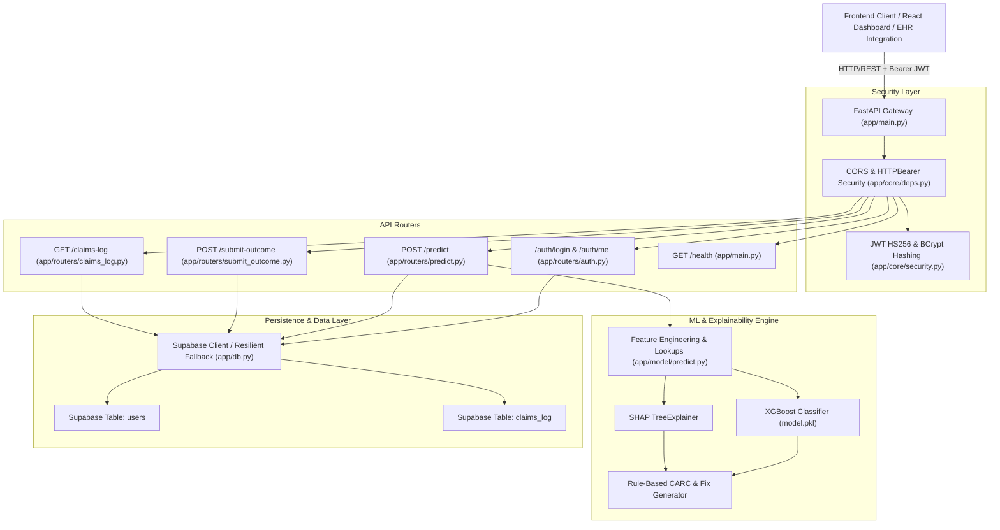

# DenialGuard AI — Complete Backend Architecture & API Specification

> **DenialGuard AI** is a production-grade AI/ML revenue cycle intelligence backend built with **FastAPI**, **XGBoost**, and **SHAP**. It predicts US healthcare claim denial probabilities (0–100%) prior to clearinghouse submission, isolates exact root causes using TreeExplainer Shapley feature attribution, forecasts likely Claim Adjustment Reason Codes (CARC), generates targeted pre-submission clinical/billing remediations, and provides JWT-authenticated audit logging backed by Supabase with resilient zero-downtime offline fallbacks.

---

## 1. System Architecture & Tech Stack



### Technology Stack
| Layer | Technologies | Purpose |
| :--- | :--- | :--- |
| **API Framework** | FastAPI `>=0.110.0`, Uvicorn `>=0.28.0` | High-performance asynchronous REST API gateway |
| **Machine Learning** | XGBoost `>=2.0.0`, Scikit-Learn `>=1.4.0`, NumPy, Pandas | Gradient-boosted decision trees trained on 120,000 claim records |
| **Explainability** | SHAP `>=0.45.0` (`TreeExplainer`) | Exact per-claim Shapley attribution values & root-cause identification |
| **Authentication & RBAC**| PyJWT `>=2.8.0`, Passlib/BCrypt | Stateless JWT Bearer tokens with 24-hour expiration & password hashing |
| **Data Validation** | Pydantic v2 (`pydantic>=2.6.0`, `pydantic-settings>=2.2.0`) | Strict input/output payload validation and schema enforcement |
| **Persistence** | Supabase PostgreSQL (`supabase>=2.3.0`) + In-Memory Fallback | Dual-mode persistence for cloud production or resilient offline operation |

---

## 2. Directory Structure & File Map

```
backend/
├── app/
│   ├── __init__.py               # App package initializer
│   ├── main.py                   # FastAPI app entrypoint, CORS configuration, router mounting, /health
│   ├── db.py                     # Supabase database client wrapper, user store, claims_log CRUD, offline fallback
│   ├── schemas.py                # Strict Pydantic models for claim inputs, responses, auth, and logs
│   ├── core/
│   │   ├── __init__.py           # Security package initializer
│   │   ├── security.py           # JWT token generation, verification (HS256) & bcrypt password hashing
│   │   └── deps.py               # FastAPI Depends(get_current_user) Bearer token validator
│   ├── model/
│   │   ├── __init__.py           # Model package initializer
│   │   ├── train.py              # ML training pipeline on 120k records with cross-validation and metrics output
│   │   ├── predict.py            # Feature engineering, XGBoost inference, and SHAP explanation engine
│   │   ├── model.pkl             # Serialized production XGBoost model artifact (git-ignored)
│   │   ├── feature_lookups.pkl   # Pre-computed historical denial priors & specialty benchmarks (git-ignored)
│   │   ├── metrics.json          # Production model evaluation metrics (accuracy, F1, precision, recall, AUC)
│   │   └── metrics_synthetic_baseline.json # Baseline benchmark records
│   └── routers/
│       ├── __init__.py           # Routers package initializer
│       ├── auth.py               # POST /auth/login and GET /auth/me (plus alias routes)
│       ├── predict.py            # POST /predict (protected claim risk inference and logging)
│       ├── claims_log.py         # GET /claims-log (protected historical audit query)
│       └── submit_outcome.py     # POST /submit-outcome (protected closed-loop adjudication update)
├── data/                         # Training data caches and lookup matrices
│   ├── cleaned_claims_final.csv  # Cleaned input dataset
│   ├── training_dataset_final.csv # Fully feature-engineered training dataset (120,000 rows)
│   ├── imputation_report.json    # Statistical imputation audit report
│   ├── impute_missing_fields.py  # Data imputation script
│   ├── generate_synthetic_claims.py # Synthetic augmentation generator
│   └── synthetic_field_generators.py # Realistic field generation rules
├── .env.example                  # Template of required environment variables
├── requirements.txt              # Production Python package dependencies
├── supabase_users_migration.sql  # SQL DDL script for Supabase users table & seed accounts
└── test_backend.py               # Complete automated test suite covering ML, SHAP, auth, and logs
```

---

## 3. User Authentication & Security Strategy

### Authentication Workflow
1. **User Sign In (`POST /auth/login` or `POST /login`):**
   - User submits `work_email` and `password`.
   - The backend checks the Supabase `users` table (or local resilient user store).
   - Validates password using bcrypt hashing.
   - Signs and returns a 24-hour JWT Bearer token along with user context (`email`, `name`, `role`).
2. **Session Restoration (`GET /auth/me` or `GET /me`):**
   - Frontend passes `Authorization: Bearer <token>`.
   - Resolves and verifies user payload from the decoded token claims.
3. **Route Protection:**
   - Critical routes (`/predict`, `/claims-log`, `/submit-outcome`) inject `current_user: dict = Depends(get_current_user)`.
   - Missing or expired tokens immediately trigger `401 Unauthorized` with `WWW-Authenticate: Bearer`.

### Pre-Seeded Default Accounts
| Email | Password | Display Name | Role | Access Scope |
| :--- | :--- | :--- | :--- | :--- |
| `admin@denialguard.com` | `password123` | Alice Admin | `Admin` | Full system access, configuration & audits |
| `malvarez@northstar.health` | `password123` | Maya Alvarez | `Analyst` | Analytics, risk predictions & outcome reviews |
| `jlee@northstar.health` | `password123` | Jordan Lee | `Biller` | Pre-submission claim checking & corrections |
| `biller@denialguard.com` | `password123` | Bob Biller | `Biller` | Pre-submission claim checking & corrections |

---

## 4. Machine Learning & Explainability Pipeline

### Feature Set (20 Raw Inputs + 3 Engineered Features)
The inference engine consumes 20 standard CMS-1500 / UB-04 claim fields validated via strict Pydantic `Literal[...]` types:

| Field | Type | Description | Allowed / Canonical Values |
| :--- | :--- | :--- | :--- |
| `claim_id` | `string` | Unique claim identifier (auto-generated if omitted) | `"CLM-2026-08397"` |
| `claim_type` | `Literal` | Type of health insurance claim | `"Professional"`, `"Institutional"`, `"Dental"`, `"Vision"` |
| `payer` | `Literal` | Payer / Insurance carrier name | `"Medicare"`, `"Medicaid"`, `"UnitedHealthcare"`, `"BlueCross"`, `"Aetna"`, `"Cigna"`, `"Humana"` |
| `plan_type` | `Literal` | Health plan benefit category | `"HMO"`, `"PPO"`, `"EPO"`, `"POS"`, `"Medicare Advantage"`, `"Commercial"` |
| `eligibility_status` | `Literal` | Patient insurance eligibility on Date of Service | `"Active"`, `"Inactive"`, `"Pending"`, `"Terminated"` |
| `provider_specialty` | `Literal` | Medical provider specialty | `"Cardiology"`, `"Orthopedics"`, `"General Practice"`, `"Dermatology"`, `"Oncology"`, `"Radiology"`, `"Neurology"`, `"Internal Medicine"`, `"Emergency Medicine"` |
| `network_status` | `Literal` | Provider in-network status with target payer | `"In-Network"`, `"Out-of-Network"` |
| `icd10_code` | `string` | Primary ICD-10 diagnosis code | `"I10"`, `"E11.9"`, `"M25.50"`, `"M17.11"`, `"M54.5"` |
| `cpt_code` | `string` | Primary CPT / HCPCS procedure code | `"99213"`, `"99214"`, `"27447"`, `"99285"`, `"20610"` |
| `modifiers` | `string` | CPT procedure modifier(s) | `"None"`, `"25"`, `"59"`, `"LT"`, `"RT"` |
| `pos_code` | `string` | CMS Place of Service code | `"11"` (Office), `"21"` (Inpatient), `"22"` (Outpatient), `"23"` (ER), `"02"` (Telehealth) |
| `units_billed` | `integer` | Billed procedure units ($\ge 1$) | `1`, `2`, `4` |
| `charge_amount` | `float` | Total billed dollar charge amount ($> 0$) | `4500.00` |
| `pa_status` | `Literal` | Prior Authorization status | `"Approved"`, `"Missing"`, `"Denied"`, `"Not Required"`, `"Pending"` |
| `referral_status` | `Literal` | PCP referral status | `"Active"`, `"Missing"`, `"Not Required"`, `"Expired"` |
| `documentation_flag` | `boolean` | Flag indicating attached clinical chart notes | `true` or `false` |
| `dos` | `date` | Date of Service (`YYYY-MM-DD`) | `"2026-06-01"` |
| `submission_date` | `date` | Target Claim Submission Date (`YYYY-MM-DD`) | `"2026-08-25"` |
| `days_to_filing_deadline` | `integer` | Days remaining before payer timely filing deadline | `5`, `45`, `90` |
| `cob_flag` | `boolean` | Coordination of Benefits flag | `true` or `false` |

#### 3 Engineered Features (Pre-computed Lookup Matrix):
1. `hist_denial_rate_cpt_payer`: Historical denial frequency for the specific `cpt_code::payer` combination.
2. `hist_denial_rate_provider_payer`: Historical denial rate for the `provider_specialty::payer` combination.
3. `claim_amount_deviation`: Percentage deviation of the billed `charge_amount` relative to the mean benchmark charge for that specific procedure and payer:
   $$\text{claim\_amount\_deviation} = \left(\frac{\text{charge\_amount} - \overline{\text{charge}}_{\text{cpt, payer}}}{\overline{\text{charge}}_{\text{cpt, payer}}}\right) \times 100\%$$

---

### SHAP TreeExplainer & Root Cause Attribution
- Computes exact local Shapley values using `shap.TreeExplainer` on the trained XGBoost tree ensemble.
- Translates raw feature impacts into human-readable billing explanations (e.g., *"Clinical Documentation Attached"*, *"Prior Authorization Status"*, *"Patient Eligibility Status"*, *"Charge Amount Variance"*, *"Timely Filing Deadline Margin"*).
- Ranks contributing factors by absolute SHAP impact and classifies whether each factor `increases_risk` or `decreases_risk`.

---

### SHAP-Driven CARC Forecasting & Corrective Action Rules
When high risk is detected ($\text{risk\_score} \ge \text{CLEAN\_RISK\_THRESHOLD} = 35.0\%$), `determine_carc_and_action()` consults `top_factors` to identify the top risk-increasing SHAP driver and maps it to the standard Claim Adjustment Reason Code (CARC):

| Top SHAP Driver Feature | CARC Code | Code Description | Actionable Pre-Submission Recommendation |
| :--- | :---: | :--- | :--- |
| `pa_status` | **`CO-197`** | Precertification / Prior Authorization Absent | *"Pre-certification / Prior authorization absent, pending, or denied. Obtain prior authorization approval number from payer and append to Box 23/24."* |
| `documentation_flag` | **`CO-16`** | Missing Documentation / Information | *"Claim lacks required clinical documentation. Attach medical records, operative notes, or lab reports supporting medical necessity."* |
| `eligibility_status` | **`CO-27`** | Expenses Incurred After Coverage Terminated | *"Expenses incurred after coverage terminated or patient eligibility inactive. Re-verify active subscriber policy with payer before submitting."* |
| `days_to_filing_deadline` | **`CO-29`** | Timely Filing Limit Expired | *"Submission is within X days of timely filing deadline. Expedite batch processing immediately to avoid time-limit denial."* |
| `network_status` / `referral_status` | **`CO-50`** | Non-Covered Service / Plan Exclusion | *"Out-of-network service or missing PCP referral. Obtain and document formal referral authorization prior to billing."* |
| `cpt_code` / `modifiers` | **`CO-4`** | Procedure / Modifier Inconsistency | *"Procedure code may require modifier for distinct procedural service. Review bundling edits and consider appending Modifier 25 or 59."* |
| `claim_amount_deviation` / `charge_amount` | **`CO-45`** | Charge Amount Fee Schedule Variance | *"Charge amount exceeds expected fee schedule variance. Verify billed units and contracted rate schedule."* |
| `hist_denial_rate_*` | **`CO-97`** | Historical Denial Pattern | *"Elevated historical denial pattern for this CPT/Payer combination. Conduct secondary audit on charge amounts and diagnostic coding alignment."* |
| Score $< 35.0\%$ | **`CLEAN`** | Clean Claim (< 35% Risk Score) | *"Claim validation passed with low denial risk. Ready for clean EDI submission."* |

---

### Model Performance Benchmarks & Multi-Threshold Regimes (`metrics.json`)
- **Training Records:** 120,000 CMS-1500 claims (strict train/test isolation, zero data leakage)
- **Test Holdout Split:** 24,000 records (20% holdout, 28.05% true denial prevalence)
- **ROC AUC:** `0.8498`
- **PR-AUC (Average Precision):** `0.8257`
- **Inference Latency:** `27.3ms – 72.7ms` per full SHAP explanation (SLA: `< 110ms`)

#### Production Operating Regimes

| Operating Regime | Decision Threshold ($T$) | Recall | Precision | F1 Score | Accuracy | Target Use Case |
| :--- | :---: | :---: | :---: | :---: | :---: | :--- |
| **1. Recall-Optimized** | **`0.25` (25%)** | **`84.84%`** | `41.10%` | `0.5538` | `61.64%` | High-risk surgical / oncology specialties (zero tolerance for missed denials) |
| **2. Balanced Production (Default)** | **`0.35` (35%)** | **`71.71%`** | **`72.59%`** | **`0.7215`** | **`84.47%`** | Standard revenue cycle operations (optimal clinical/billing balance) |
| **3. High-Precision / F1-Max** | **`0.50` (50%)** | `66.45%` | **`87.43%`** | **`0.7551`** | **`87.91%`** | Automated billing workflows requiring high certainty |
| **4. Maximum Precision** | **`0.65` (65%)** | `63.82%` | **`94.03%`** | **`0.7603`** | **`88.71%`** | Conservative audit escalation |

---

### CARC Multi-Class Validation & Rule Overlap Analysis
Evaluated across all 24,000 held-out test claims:
- **Overall Multi-Class Accuracy:** `88.0%`
- **Per-Class Metrics:**
  - `CO-16` (Missing Documentation): Precision `1.00` | Recall `1.00` | F1 `1.00`
  - `CO-27` (Coverage Inactive/Terminated): Precision `0.69` | Recall `0.86` | F1 `0.77`
  - `CO-197` (Prior Auth Missing/Denied): Precision `0.95` | Recall `0.64` | F1 `0.77`
  - `CLEAN` (Clean Claim): Precision `0.88` | Recall `0.96` | F1 `0.92`
- **Rule Overlap Frequency:** **16.40% of claims (3,937 / 24,000)** trigger $\ge 2$ rules simultaneously (e.g. missing PA + unattached notes).
- **Tie-Breaking Priority:**
  $$\text{CO-27 (Eligibility)} \succ \text{CO-197 (Prior Auth)} \succ \text{CO-16 (Documentation)} \succ \text{CO-29 (Filing Deadline)} \succ \text{CO-50 (OON Referral)} \succ \text{CO-4 (Modifiers)} \succ \text{CO-97 (Priors)}$$

---

## 5. Database Architecture (Supabase PostgreSQL)

### Table: `users`
```sql
CREATE TABLE IF NOT EXISTS users (
    id UUID PRIMARY KEY DEFAULT gen_random_uuid(),
    work_email TEXT UNIQUE NOT NULL,
    password_hash TEXT NOT NULL,
    name TEXT NOT NULL,
    role TEXT NOT NULL CHECK (role IN ('Biller', 'Analyst', 'Admin', 'Read-only')),
    created_at TIMESTAMPTZ DEFAULT now()
);

CREATE INDEX IF NOT EXISTS idx_users_work_email ON users(LOWER(work_email));
```

### Table: `claims_log`
```sql
CREATE TABLE IF NOT EXISTS claims_log (
    id UUID PRIMARY KEY DEFAULT gen_random_uuid(),
    claim_id TEXT UNIQUE NOT NULL,
    claim_type TEXT,
    payer TEXT,
    plan_type TEXT,
    eligibility_status TEXT,
    provider_specialty TEXT,
    network_status TEXT,
    icd10_code TEXT,
    cpt_code TEXT,
    modifiers TEXT,
    pos_code TEXT,
    units_billed INT,
    charge_amount NUMERIC(10, 2),
    pa_status TEXT,
    referral_status TEXT,
    documentation_flag BOOLEAN,
    dos DATE,
    submission_date DATE,
    days_to_filing_deadline INT,
    cob_flag BOOLEAN,
    hist_denial_rate_cpt_payer NUMERIC(5, 4),
    hist_denial_rate_provider_payer NUMERIC(5, 4),
    claim_amount_deviation NUMERIC(6, 2),
    predicted_risk_score NUMERIC(5, 2),
    predicted_carc_code TEXT,
    top_contributing_factors JSONB,
    suggested_corrective_action TEXT,
    actual_outcome TEXT,
    denial_flag BOOLEAN,
    created_at TIMESTAMPTZ DEFAULT now(),
    updated_at TIMESTAMPTZ DEFAULT now(),
    outcome_submitted_at TIMESTAMPTZ
);

CREATE INDEX IF NOT EXISTS idx_claims_log_created_at ON claims_log(created_at DESC);
CREATE INDEX IF NOT EXISTS idx_claims_log_claim_id ON claims_log(claim_id);
```

### Table: `appeals`
```sql
CREATE TABLE IF NOT EXISTS public.appeals (
    id TEXT PRIMARY KEY,
    workspace_id TEXT DEFAULT 'ws-northstar-001',
    claim_id TEXT NOT NULL,
    payer TEXT,
    level TEXT DEFAULT 'Level 1',
    status TEXT DEFAULT 'drafting',
    docs_attached INTEGER DEFAULT 0,
    notes TEXT,
    created_at TIMESTAMPTZ DEFAULT now(),
    updated_at TIMESTAMPTZ DEFAULT now()
);

CREATE INDEX IF NOT EXISTS idx_appeals_claim_id ON appeals(claim_id);
CREATE INDEX IF NOT EXISTS idx_appeals_status ON appeals(status);
```

### Table: `claim_documents`
```sql
CREATE TABLE IF NOT EXISTS public.claim_documents (
    id TEXT PRIMARY KEY,
    claim_id TEXT NOT NULL,
    workspace_id TEXT DEFAULT 'ws-northstar-001',
    uploaded_by TEXT,
    document_type TEXT,
    document_title TEXT,
    storage_path TEXT,
    uploaded_at TIMESTAMPTZ DEFAULT now()
);

CREATE INDEX IF NOT EXISTS idx_claim_documents_claim_id ON claim_documents(claim_id);
```

### Table: `notifications`
```sql
CREATE TABLE IF NOT EXISTS public.notifications (
    id TEXT PRIMARY KEY,
    workspace_id TEXT DEFAULT 'ws-northstar-001',
    title TEXT NOT NULL,
    message TEXT NOT NULL,
    type TEXT DEFAULT 'system',
    link TEXT,
    is_read BOOLEAN DEFAULT FALSE,
    created_at TIMESTAMPTZ DEFAULT now()
);

CREATE INDEX IF NOT EXISTS idx_notifications_workspace ON notifications(workspace_id, created_at DESC);
```

### Dual-Mode Persistence & Zero-Downtime Fallback
The backend automatically checks connectivity to Supabase:
1. **Online Mode (Supabase Configured & Connected):** Reads and writes directly to PostgreSQL with real-time audit capability across `claims_log`, `appeals`, `claim_documents`, and `notifications`.
2. **Offline Fallback Mode (Unconfigured or Disconnected):** Operations seamlessly buffer to a thread-safe in-memory cache, ensuring that zero endpoints crash and demonstrations never fail.

---

## 6. Complete REST API Reference

### 6.1 Authentication Endpoints

#### `POST /auth/login` (or `POST /login`)
Authenticate work credentials and receive a signed JWT access token.

- **Request Body:**
```json
{
  "work_email": "admin@denialguard.com",
  "password": "password123"
}
```

- **Response (`200 OK`):**
```json
{
  "access_token": "eyJhbGciOiJIUzI1NiIsInR5cCI6IkpXVCJ9...",
  "token_type": "bearer",
  "user": {
    "email": "admin@denialguard.com",
    "name": "Alice Admin",
    "role": "Admin"
  }
}
```

- **Example `curl`:**
```bash
curl -X POST http://localhost:8000/auth/login \
  -H "Content-Type: application/json" \
  -d '{"work_email":"admin@denialguard.com","password":"password123"}'
```

---

#### `GET /auth/me` (or `GET /me`)
Retrieve current user session metadata from the Bearer token.

- **Headers:** `Authorization: Bearer <access_token>`
- **Response (`200 OK`):**
```json
{
  "email": "admin@denialguard.com",
  "name": "Alice Admin",
  "role": "Admin"
}
```

---

### 6.2 ML Prediction & Risk Explanation

#### `POST /predict`
Run pre-submission denial prediction, compute SHAP feature attributions, predict CARC reason code, and log claim audit record.

- **Headers:** `Authorization: Bearer <access_token>`
- **Request Body:**
```json
{
  "claim_id": "CLM-2026-08397",
  "claim_type": "Institutional",
  "payer": "UnitedHealthcare",
  "plan_type": "HMO",
  "eligibility_status": "Inactive",
  "provider_specialty": "Orthopedics",
  "network_status": "Out-of-Network",
  "icd10_code": "M25.50",
  "cpt_code": "27447",
  "modifiers": "None",
  "pos_code": "21",
  "units_billed": 1,
  "charge_amount": 5200.00,
  "pa_status": "Missing",
  "referral_status": "Missing",
  "documentation_flag": false,
  "dos": "2026-06-01",
  "submission_date": "2026-08-25",
  "days_to_filing_deadline": 5,
  "cob_flag": false
}
```

- **Response (`200 OK`):**
```json
{
  "claim_id": "CLM-2026-08397",
  "risk_score": 100.0,
  "predicted_carc_code": "CO-27",
  "top_contributing_factors": [
    {
      "feature": "Clinical Documentation Attached",
      "impact": 8.2101,
      "direction": "increases_risk"
    },
    {
      "feature": "Patient Eligibility Status",
      "impact": 0.7168,
      "direction": "increases_risk"
    },
    {
      "feature": "Referral Status",
      "impact": 0.2897,
      "direction": "increases_risk"
    },
    {
      "feature": "Charge Amount Variance",
      "impact": 0.1851,
      "direction": "increases_risk"
    }
  ],
  "suggested_corrective_action": "Expenses incurred after coverage terminated or patient eligibility inactive. Re-verify active subscriber policy with payer before submitting."
}
```

- **Example `curl`:**
```bash
curl -X POST http://localhost:8000/predict \
  -H "Content-Type: application/json" \
  -H "Authorization: Bearer <access_token>" \
  -d '{
    "claim_id": "CLM-2026-08397",
    "claim_type": "Institutional",
    "payer": "UnitedHealthcare",
    "plan_type": "HMO",
    "eligibility_status": "Inactive",
    "provider_specialty": "Orthopedics",
    "network_status": "Out-of-Network",
    "icd10_code": "M25.50",
    "cpt_code": "27447",
    "modifiers": "None",
    "pos_code": "21",
    "units_billed": 1,
    "charge_amount": 5200.00,
    "pa_status": "Missing",
    "referral_status": "Missing",
    "documentation_flag": false,
    "dos": "2026-06-01",
    "submission_date": "2026-08-25",
    "days_to_filing_deadline": 5,
    "cob_flag": false
  }'
```

---

### 6.3 Outcome Feedback & Closed-Loop Adjudication

#### `POST /submit-outcome`
Records the final clearinghouse / payer adjudication result (`paid` vs `denied`) for a claim.

- **Headers:** `Authorization: Bearer <access_token>`
- **Request Body:**
```json
{
  "claim_id": "CLM-2026-08397",
  "actual_outcome": "denied",
  "denial_flag": true
}
```

- **Response (`200 OK`):**
```json
{
  "status": "success",
  "claim_id": "CLM-2026-08397",
  "actual_outcome": "denied",
  "denial_flag": true,
  "updated_at": "2026-09-03T16:26:50.740647+00:00"
}
```

- **Error Response (`404 Not Found`):**
*(Returned when attempting to update a claim ID that does not exist in the database)*
```json
{
  "detail": "Claim ID not found"
}
```

---

### 6.4 Claims Audit Log Query

#### `GET /claims-log`
Fetches historical claim predictions, risk scores, and adjudication status ordered by creation date descending.

- **Headers:** `Authorization: Bearer <access_token>`
- **Query Parameters:**
  - `limit` (optional integer, default: `50`, max: `500`)
- **Response (`200 OK`):**
```json
[
  {
    "claim_id": "CLM-2026-08397",
    "payer": "UnitedHealthcare",
    "cpt_code": "27447",
    "charge_amount": 5200.0,
    "predicted_risk_score": 100.0,
    "predicted_carc_code": "CO-27",
    "actual_outcome": "denied",
    "denial_flag": true,
    "created_at": "2026-09-03T16:26:50.740647+00:00"
  }
]
```

---

#### `POST /appeals`
Create a new clinical appeal for an existing claim.
- **Validation Guard 1 (Duplicate Active Appeal):** Rejects submissions if an open appeal already exists with `409 Conflict`.
- **Validation Guard 2 (Clean Claim Prevention):** Rejects submissions if the claim is marked clean (`predicted_carc_code == 'CLEAN'` or `status == 'paid'`) with `400 Bad Request`.

- **Headers:** `Authorization: Bearer <access_token>`
- **Request Body:**
```json
{
  "claim_id": "CLM-2026-08397",
  "appeal_level": "Level 1",
  "attached_document_ids": ["doc-21f7c1ee"],
  "notes": "Appealing CO-16 denial with attached operative report"
}
```
- **Response (`201 Created`):**
```json
{
  "id": "APL-C73317",
  "claim_id": "CLM-2026-08397",
  "appeal_level": "Level 1",
  "status": "drafting",
  "payer": "UnitedHealthcare",
  "billed_amount": "5200.00",
  "deadline": "Oct 04, 2026",
  "attached_document_ids": ["doc-21f7c1ee"],
  "notes": "Appealing CO-16 denial with attached operative report",
  "created_at": "2026-09-04T03:00:00.000000+00:00",
  "updated_at": "2026-09-04T03:00:00.000000+00:00"
}
```

- **Error Response — Duplicate Appeal (`409 Conflict`):**
```json
{
  "detail": "An active appeal (APL-C73317) is already in 'drafting' status for claim CLM-2026-08397. Resolve or close the existing appeal before starting a new one."
}
```

- **Error Response — Clean Claim (`400 Bad Request`):**
```json
{
  "detail": "Cannot initiate an appeal for clean claim CLM-2026-08397. Appeals are only permitted for denied or high-risk claims with actionable CARC codes."
}
```

#### `POST /claims/{claim_id}/documents`
Upload and persist clinical chart notes / PDF records in Supabase, automatically re-running the ML prediction model.

- **Headers:** `Authorization: Bearer <access_token>`
- **Request Form:** `multipart/form-data` with `file: <Binary>` and `document_type: "operative_report"`
- **Response (`200 OK`):** Returns uploaded document metadata (`id`, `storage_path`, `document_title`) and updated claim prediction.

---

### 6.6 System Health & Metrics

#### `GET /health` (or `GET /`)
Public system monitoring probe returning service health, active ML engine, and evaluation benchmarks.

- **Response (`200 OK`):**
```json
{
  "status": "healthy",
  "service": "DenialGuard AI Backend",
  "version": "1.1.0",
  "model_engine": "XGBoost + SHAP TreeExplainer",
  "metrics": {
    "dataset_size": 120000,
    "test_size": 24000,
    "accuracy": 0.8785,
    "precision": 0.8717,
    "recall": 0.6648,
    "f1_score": 0.7543,
    "roc_auc": 0.8497
  }
}
```

---

## 7. HTTP Status Codes & Error Handling Matrix

| HTTP Status | Error Reason | Typical Trigger | Response Body |
| :--- | :--- | :--- | :--- |
| `200 OK` | Success | Valid request executed successfully | Object / List payload |
| `201 Created` | Resource Created | Successful appeal initiation (`POST /appeals`) | Created appeal entity |
| `401 Unauthorized` | Missing / Invalid Token | Missing `Authorization` header, invalid signature, expired JWT, or wrong credentials | `{"detail": "Could not validate credentials"}` |
| `404 Not Found` | Resource Missing | Outcome submission targeting an unknown `claim_id` | `{"detail": "Claim ID not found"}` |
| `409 Conflict` | Duplicate Active Appeal | Attempting to create an appeal on a claim with an existing open appeal | `{"detail": "An active appeal (APL-XXXXXX) is already in 'drafting' status..."}` |
| `422 Unprocessable Entity` | Validation Error | Missing required fields, invalid date format, or out-of-range numeric input | `{"detail": [{"loc": ["body", "charge_amount"], "msg": "Input should be greater than 0"}]}` |
| `500 Internal Server Error` | Server Exception | Unhandled runtime exception in model execution | `{"detail": "Internal server error message"}` |

---

## 8. Environment Configuration (`.env`)

Create a `.env` file in `backend/` by referencing [`.env.example`](file:///c:/Users/kayel/my-hackathon-project/backend/.env.example):

```env
# Supabase Postgres Connection
SUPABASE_URL=https://your-project-ref.supabase.co
SUPABASE_SERVICE_ROLE_KEY=your-supabase-service-role-key-here

# JWT Authentication
SECRET_KEY=your-strong-secret-key-here-minimum-32-chars
ALGORITHM=HS256
ACCESS_TOKEN_EXPIRE_MINUTES=1440

# Server & CORS Configuration
PORT=8000
HOST=0.0.0.0
FRONTEND_ORIGIN=http://localhost:3000
```

---

## 9. Quick Start & Developer Guide

### Step 1: Install Python Dependencies
```powershell
cd backend
python -m pip install -r requirements.txt
```

### Step 2: (Optional) Run Database Migration
If connecting to a live Supabase project, execute [`supabase_users_migration.sql`](file:///c:/Users/kayel/my-hackathon-project/backend/supabase_users_migration.sql) in your Supabase SQL Editor. If skipped, the backend operates in resilient offline mode with default seed accounts.

### Step 3: Run Verification Suites
```powershell
# Run ML, schema validation, and priority fixes verification
python -u test_fixes_verification.py

# Run comprehensive backend auth & API verification
python -u test_backend.py
```
Expected output:
```
=== DENIALGUARD AI BACKEND VERIFICATION SUITE (AUTH + ML) ===
[TEST 1] Testing GET /health: PASS (200 OK)
[TEST 2] Testing POST /auth/login with valid credentials: PASS (200 OK)
[TEST 3] Testing POST /auth/login with invalid password: PASS (401 Unauthorized)
[TEST 4] Testing GET /auth/me with Bearer token: PASS (200 OK)
[TEST 5] Testing route protection without token: PASS (401 Unauthorized)
[TEST 6] Testing POST /predict with High-Risk Claim: PASS (Risk: 100.0%, CARC: CO-16)
[TEST 7] Testing POST /predict with Clean/Low-Risk Claim: PASS (Risk: 32.9%, Clean)
[TEST 8] Testing POST /submit-outcome for existing claim: PASS (200 OK)
[TEST 9] Testing POST /submit-outcome for non-existent claim: PASS (404 Not Found)
[TEST 10] Testing GET /claims-log: PASS (200 OK)

>>> ALL 10 TESTS PASSED SUCCESSFULLY! <<<
```

### Step 4: Launch Backend Server
```powershell
python -m uvicorn app.main:app --host 0.0.0.0 --port 8000 --reload
```
- Interactive Swagger UI: `http://localhost:8000/docs`
- OpenAPI Specification: `http://localhost:8000/openapi.json`

